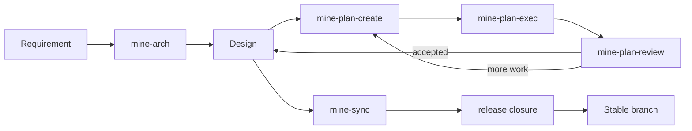

<h1 align="center">MINE</h1>

<p align="center"><strong>MINE Is Not Everyone's.</strong></p>

<p align="center">An opinionated engineering workflow for Claude Code, Codex, Pi, and OpenCode.</p>

<p align="center">
  <a href="https://github.com/6ixGODD/mine-is-not-everyones/blob/master/LICENSE"></a>
  
  
</p>

<p align="center"><a href="README.md">English</a> · <a href="README.zh-CN.md">简体中文</a></p>

---

## Why MINE

Coding agents are good at solving the task in front of them. Software projects are harder: the architecture has to survive across sessions, implementation has to be checked against an explicit target, parallel work has to be coordinated, and a release should contain the product rather than the temporary process that produced it.

MINE gives coding agents a repository-native workflow for that larger problem.



Five Agent Skills handle engineering judgment:

| Skill | Use it when |
|---|---|
| `mine-arch` | you want to define or change the target architecture |
| `mine-sync` | you need Design to reflect the code that actually exists |
| `mine-plan-create` | the Design is ready and implementation work needs to be packaged |
| `mine-plan-exec` | one Plan is ready to implement |
| `mine-plan-review` | implementation needs independent review or the release needs closing |

The Rust `mine` binary handles deterministic state: repository initialization, Plan and graph transitions, validation, Agent installation, locking, release preflight, and the native stale-reference scan.

## Install

### Windows

```powershell
irm https://raw.githubusercontent.com/6ixGODD/mine-is-not-everyones/master/scripts/bootstrap.ps1 | iex
```

### macOS / Linux

```sh
curl -fsSL https://raw.githubusercontent.com/6ixGODD/mine-is-not-everyones/master/scripts/bootstrap.sh | sh
```

Then reopen the terminal and verify:

```sh
mine --version
mine agent status
```

To install a specific release, set `MINE_REF` before running the bootstrap script.

### Claude Code plugin

```text
/plugin marketplace add 6ixGODD/mine-is-not-everyones
/plugin install mine@mine-is-not-everyones
```

<details>
<summary>Build from source</summary>

```sh
cargo install --path . --locked
mine setup
```

</details>

## Start a project

Initialize MINE once at the repository root:

```sh
mine init
```

Then choose the starting path.

**New work / a new target:**

```text
mine-arch <what you want to build or change>
mine-plan-create
mine-plan-exec <Plan path>
mine-plan-review <Plan path>
```

**An existing codebase with no trustworthy Design baseline:**

```text
mine-sync <scope, if the repository is large>
mine-arch <the next change>
mine-plan-create
mine-plan-exec <Plan path>
mine-plan-review <Plan path>
```

Repeat Execute → Review for the Plans produced by the graph. You do not normally manage graph revisions, report paths, `plan/*` branches, or `dev` integration by hand.

When all Plans are accepted:

```text
mine-sync prepare this repository for stable release
mine-plan-review complete release closure
```

MINE closes the local release; pushing and publishing remain explicit user actions.

## What is kept, and what disappears

`docs/design/` is durable engineering knowledge. It remains on the stable branch.

`docs/plan/`, `dev`, `plan/*`, execution reports, and the execution graph are temporary coordination state. They exist while the work is being built and reviewed, then disappear from the stable release.

MINE does not require a Plan for every edit. Behavior-preserving editorial maintenance—typos, translation, prose, links, README cleanup—can be done directly. Changes to behavior, architecture, public contracts, Skills, CLI semantics, release rules, security boundaries, or other durable engineering decisions use the MINE lifecycle.

## Supported clients

- Claude Code
- Codex
- Pi
- OpenCode

## Documentation

- [User Guide](docs/user-guide.md) — installation, project setup, daily workflow, review, and release
- [Concepts](docs/concepts.md) — the mental model behind Design, Plans, branches, review, and release
- [Documentation index](docs/README.md) — all English documentation and internal Design entry points
- [Design index](docs/design/index.md) — MINE's internal durable architecture

## Status

MINE is early-stage and intentionally opinionated. Use it first in a repository whose history and working tree you can recover.

## License

MIT