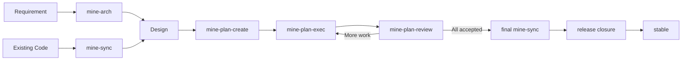

<h1 align="center">MINE</h1>

<p align="center"><strong>MINE Is Not Everyone's.</strong></p>

<p align="center">
  A document-driven software engineering workflow for Coding Agents.
</p>

<p align="center">
  <a href="https://github.com/6ixGODD/mine-is-not-everyones/blob/master/LICENSE"></a>
  
  
</p>

<p align="center"><a href="README.md">English</a> · <a href="README.zh-CN.md">简体中文</a></p>

---

## What is MINE?

Coding Agents are good at completing individual tasks with clear goals and boundaries. Software engineering, however, is rarely a single conversation. A project often spans multiple sessions, multiple stages, and several parallel workstreams.

Requirements, architectural decisions, implementation plans, task dependencies, review conclusions, and release state accumulate throughout that process. If this information exists only in conversational context, it disappears with the session. The problem becomes more pronounced when multiple Agents work in parallel: each Agent may hold an incomplete or even contradictory understanding of the system.

MINE addresses this by **persisting engineering state in the repository and using Git to manage the development process.**

Specifically:

- `docs/design/` stores the currently accepted engineering design;
- `docs/plan/` stores execution plans for the current development cycle;
- the Execution Graph manages dependencies and execution state between Plans;
- Git branches and worktrees isolate implementations of different Plans;
- independent Review determines whether an implementation can be accepted;
- Release Closure turns the final development state back into stable product state.

MINE's goal is to **keep Design, Implementation, and Review grounded in the same persistent engineering context**, preserving consistency and traceability across sessions and Agents.

## Workflow



MINE provides five Agent Skills:

| Skill | Purpose |
|---|---|
| `mine-arch` | Create a target Design from requirements, or update an existing Design |
| `mine-sync` | Synchronize Design against the repository's actual implementation |
| `mine-plan-create` | Turn a scoped Design change into executable Plans |
| `mine-plan-exec` | Implement a Plan |
| `mine-plan-review` | Independently review an implementation and accept, reject, or close out the release |

The `mine` binary handles deterministic operations, including:

- repository initialization;
- Plan and Execution Graph state management;
- Agent integration management;
- file locking and concurrency protection;
- Design and graph validation;
- release preflight checks;
- temporary Plan-reference checks before stable release.

In normal use, you do not need to manually manage graph revisions, report paths, temporary Plan branches, or release candidates. MINE manages those states for you.

## Installation

### Recommended installation

Install the `mine` binary.

#### Windows

Run in PowerShell:

```powershell
irm https://raw.githubusercontent.com/6ixGODD/mine-is-not-everyones/master/scripts/bootstrap.ps1 | iex
```

#### macOS / Linux

Run in your terminal:

```sh
curl -fsSL https://raw.githubusercontent.com/6ixGODD/mine-is-not-everyones/master/scripts/bootstrap.sh | sh
```

After installation, restart your terminal and verify that MINE is available:

```sh
mine --version
```

Then install the Agent integrations:

```sh
mine setup
```

`mine setup` configures the corresponding Skills and, when the client supports MCP, registers the local `mine mcp serve` server.

To inspect the current Agent integration status:

```sh
mine agent status
```

### Installing a specific version

The bootstrap installer uses the latest Release by default. Set `MINE_REF` to install a specific version.

For example, to install `v0.1.4`:

#### Windows

```powershell
$env:MINE_REF = "v0.1.4"
irm https://raw.githubusercontent.com/6ixGODD/mine-is-not-everyones/master/scripts/bootstrap.ps1 | iex
```

#### macOS / Linux

```sh
MINE_REF=v0.1.4 \
sh -c "$(curl -fsSL https://raw.githubusercontent.com/6ixGODD/mine-is-not-everyones/master/scripts/bootstrap.sh)"
```

`MINE_REF` identifies the Git tag to install, for example `v0.1.4`.

### Agent integrations

MINE currently supports the following Agents:

| Agent | Skills | MCP | Without MCP |
|---|---:|---:|---|
| Claude Code | ✓ | ✓ | CLI fallback |
| Codex | ✓ | ✓ | CLI fallback |
| OpenCode | ✓ | ✓ | CLI fallback |
| Pi | ✓ | Optional | CLI fallback |

Skills prefer MINE's deterministic MCP interfaces. When MCP is unavailable, they automatically fall back to the `mine --format json` CLI interface.

Pi's minimal core does not include MCP support. MINE does not require users to install an MCP adapter for Pi, so Pi can operate entirely through Skills + CLI.

### Claude Code Marketplace

Claude Code users may also install the MINE Skills through Marketplace:

```text
/plugin marketplace add 6ixGODD/mine-is-not-everyones
/plugin install mine@mine-is-not-everyones
```

Marketplace installs the MINE Skills for Claude Code. It does not install the `mine` binary itself.

After Marketplace installation, Claude Code loads the Skills under the plugin namespace, for example:

```text
/mine:mine-arch
```

For full state management, CLI, and MCP functionality, the `mine` binary should still be installed through the bootstrap installer.

<details>
<summary>Install from source</summary>

Requires Rust 1.85 or later:

```sh
cargo install --path . --locked
mine setup
```

</details>

## Getting Started

Initialize MINE once from the root of a Git repository:

```sh
mine init
```

Then choose the appropriate starting point for the repository.

> The names `mine-arch`, `mine-plan-create`, `mine-plan-exec`, `mine-plan-review`, and `mine-sync` below refer to Agent Skills, not `mine` CLI subcommands. Invocation syntax depends on the Coding Agent being used.

### Scenario 1: A new requirement or target Design

First turn the requirement into Design:

```text
mine-arch <requirement>
```

For example:

```text
mine-arch Add Passkey login to the existing authentication system while preserving the current session model.
```

Once Design is clear, turn the scoped change into executable work:

```text
mine-plan-create <scope to plan>
```

For example:

```text
mine-plan-create Turn the Passkey login changes we just agreed on into an execution plan.
```

Then execute and review the Plan:

```text
mine-plan-exec <Plan path>
mine-plan-review <Plan path>
```

When the user provides an explicit scope, `mine-plan-create` treats it as the planning boundary. It investigates only the relevant Design, code, dependencies, and established engineering practice rather than auditing the entire repository by default.

If invoked without a target:

```text
mine-plan-create
```

the Skill determines the next work to plan from the current Design, Execution Graph, and repository state. A bare invocation therefore usually requires broader exploration.

### Scenario 2: Existing code without a trusted MINE Design

First establish a Design baseline from the current implementation:

```text
mine-sync <scope to synchronize>
```

For example:

```text
mine-sync Synchronize the authentication, authorization, and session-management code.
```

Then describe the new target:

```text
mine-arch Add Passkey login.
mine-plan-create Turn the Passkey login change we just agreed on into an execution plan.
mine-plan-exec <Plan path>
mine-plan-review <Plan path>
```

For large repositories, give `mine-sync` an explicit scope to avoid unnecessary repository-wide inspection.

## Plans, Git, and Parallel Development

A Plan is the execution contract for one unit of implementation work.

Each Plan defines its dependencies, write scope, and acceptance criteria. When several tasks can proceed independently, separate Plans may use isolated branches and worktrees:

```text
dev
├── plan/01-api       → worktree A
├── plan/02-storage   → worktree B
└── plan/03-ui        → worktree C
```

The Execution Graph determines which Plans have satisfied their predecessors and may begin execution.

`mine-plan-create` decides, based on the current scope, Design, and dependency structure, whether work should remain one Plan or be split into multiple serial or parallel Plans. Parallelism is not a goal in itself: if decomposition only creates shared-file conflicts and coordination overhead, the work should remain a single coherent Plan.

A completed implementation does not enter `dev` immediately. It must first pass independent Review. Only `ACCEPTED` work is integrated.

## Release

Once all Plans are complete and accepted, synchronize the final Design:

```text
mine-sync prepare this repository for stable release
```

This final `mine-sync` reconciles the persistent Design with the final implementation so that `docs/design/` accurately reflects the product state that will remain after release.

Then perform local Release Closure:

```text
mine-plan-review complete release closure
```

Release Closure performs the following work:

- verifies consistency between final Design and implementation;
- checks the Execution Graph and release gates;
- constructs and validates the stable candidate;
- checks the stable tree for temporary Plan references from the current development cycle;
- removes temporary development state such as `docs/plan/`;
- integrates the final result into stable;
- cleans up MINE-managed local development branches.

MINE does not automatically push, create a remote Release, or rewrite remote history. Those actions remain under user control.

## What Remains in Stable

The stable branch retains:

```text
product code
docs/design/
user documentation
other files required by the product
```

The following development-time state does not enter the stable release:

```text
docs/plan/
execution graph
implementation / review reports
dev
plan/*
temporary worktrees
```

In short: **a Plan describes one development process; Design describes the currently valid engineering state**. Plans are temporary. Design is persistent.

Plan numbers are also meaningful only within the current development cycle. A new cycle may begin again at Plan 01, so stable releases do not allow product code to retain temporary references such as `Plan NN`, which would become ambiguous in future iterations.

## Changes That Do Not Require a Plan

MINE governs engineering changes, but not every repository edit needs the full lifecycle.

Maintenance changes that do not alter engineering behavior can usually be made directly, including:

- typo fixes;
- translation updates;
- prose cleanup;
- README and user-documentation updates;
- broken-link fixes;
- formatting changes.

Changes involving any of the following should use the normal MINE workflow:

- runtime behavior;
- architecture;
- public APIs;
- CLI or Skill semantics;
- MCP contracts;
- data structures or migrations;
- security boundaries;
- release behavior;
- other durable engineering decisions that future work must continue to follow.

The deciding question is not **which file changed**, but **whether the engineering contract changed**.

## Documentation

- [User Guide](docs/user-guide.md) — practical, step-by-step use of MINE
- [Core Concepts](docs/concepts.md) — Design, Plans, the Execution Graph, Review, and stable state

MINE's own internal architecture and implementation contracts are documented in the [Design index](docs/design/index.md).

## Project Status

MINE is still at an early stage and intentionally maintains a strong engineering opinion.

For a first trial, use a repository whose Git history and working tree can be safely recovered.

## License

MIT
