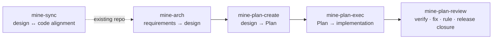

<h1 align="center">MINE</h1>

<p align="center"><strong>MINE Is Not Everyone's.</strong></p>

<p align="center">
  An opinionated, document-driven engineering workflow for Claude Code, Codex, Pi, and OpenCode.
</p>

<p align="center">
  <a href="https://github.com/6ixGODD/mine-is-not-everyones/blob/master/LICENSE"></a>
  
  
</p>

<p align="center"><a href="README.md">English</a> · <a href="README.zh-CN.md">简体中文</a></p>

---

## Why MINE

* Architecture docs drift from the implementation.
* Plans vanish with the conversation context that produced them.
* Implementation, review, and release lack clear boundaries.
* Temporary branches and process documents leak into stable releases.
* Each new session rebuilds the engineering context from scratch.

MINE keeps architecture, planning, implementation, review, and release closure in the repository, constrained by deterministic tools, versionable and traceable.

## How it works

Five Agent Skills handle workflow and engineering judgment; one Rust binary handles the deterministic parts.



| Skill | Responsibility |
|---|---|
| `mine-arch` | Create or evolve the target architecture from requirements |
| `mine-sync` | Align Design with the real repository |
| `mine-plan-create` | Break a confirmed Design change into an executable Plan |
| `mine-plan-exec` | Implement one Plan under repository governance |
| `mine-plan-review` | Independent review, direct fixes, accept/reject, and release closure |

The `mine` binary handles:

* repository initialization;
* execution-graph state;
* Plan lifecycle transitions;
* file locking and atomic writes;
* Design and graph validation;
* Agent installation and diagnostics;
* distribution asset sync;
* release preflight.

Requirements and boundaries are stated once.

## Installation

### Windows (PowerShell)

```powershell
irm https://raw.githubusercontent.com/6ixGODD/mine-is-not-everyones/master/scripts/bootstrap.ps1 | iex
```

### macOS and Linux

```sh
curl -fsSL https://raw.githubusercontent.com/6ixGODD/mine-is-not-everyones/master/scripts/bootstrap.sh | sh
```

Reopen your terminal after install. Windows installs to `%LOCALAPPDATA%\Programs\mine`; Linux/macOS to `~/.local/bin`.

### Pinning a version

The default is the latest release. Pin a tag with `MINE_REF`:

```sh
MINE_REF=v0.1.0 sh -c "$(curl -fsSL https://raw.githubusercontent.com/6ixGODD/mine-is-not-everyones/master/scripts/bootstrap.sh)"
```

```powershell
$env:MINE_REF = 'v0.1.0'
irm https://raw.githubusercontent.com/6ixGODD/mine-is-not-everyones/master/scripts/bootstrap.ps1 | iex
```

### Claude Code plugin

```text
/plugin marketplace add 6ixGODD/mine-is-not-everyones
/plugin install mine@mine-is-not-everyones
```

<details>
<summary>Building from source</summary>

Requires Rust 1.85:

```sh
cargo install --path . --locked
mine setup
```

</details>

## Quick start

Examples use Skill names directly; invocation differs per Agent client.

### New repository

Initialize Git, then initialize MINE:

```bash
git init
mine init
```

`mine init` only performs deterministic initialization; architecture, Plans, and implementation are the Skills' job.

Open an Agent and state the requirement:

```text
mine-arch Build a local task-management CLI with import, export, and undo.
```

Then:

```text
mine-plan-create
mine-plan-exec <Plan path>
mine-plan-review <Plan path>
```

### Existing repository

If the repository already uses `docs/design/` for unrelated documents, `mine init` backs it up to `docs/design-backup-<timestamp>/` and creates a fresh managed root.

```bash
mine init
```

Establish a Design baseline matching the current code:

```text
mine-sync the authentication and authorization subsystem
```

Then evolve the repository:

```text
mine-arch Add Passkey login.
mine-plan-create
mine-plan-exec <Plan path>
mine-plan-review <Plan path>
```

> For large repositories, scope `mine-sync`.

## Repository model

MINE owns `docs/design/`, marked by `docs/design/.mine-design.toml`.

During sync, current code, schemas, configuration, tests, and observable runtime behavior take precedence over stale Design, unless the user explicitly asks to preserve a design decision.

Before rewriting Design, MINE creates a local, Git-ignored backup.

`dev`, `plan/*`, `docs/plan/`, the execution graph, implementation reports, and review reports exist only during development and never enter a stable release.

## Review behavior

The Reviewer independently verifies the implementation and may directly fix narrowly scoped defects, strengthen tests, correct workflow issues, and unblock release closure, committing each fix separately, recording it in the review report, and revalidating.

A compensating Plan is created only for large independent work, substantive Design change, major scope expansion, public-contract change, or work that cannot be completed safely in the current review.

## Authority boundaries

MINE is for a single repository owner who accepts strong constraints and lets coding agents operate the repository under governance rules.

| MINE may | MINE never will |
|---|---|
| Rewrite inaccurate MINE-owned Design | Run arbitrary `git reset --hard` |
| Create and use managed `dev` and `plan/*` branches | Run `git clean` |
| Commit changes within the current Plan scope | Blind stash |
| Merge reviewed work | Force push |
| Clean up MINE's own temporary release artifacts | Rewrite public history |
| | Delete unrelated branches or files |
| | Run unbounded shell deletion |
| | Write outside the repository |

"Destructive" applies only to outdated MINE-owned Design and temporary process state.

## Supported clients

* Claude Code
* Codex
* Pi
* OpenCode

## Current status

MINE is still early-stage and intentionally opinionated.

Try it in a recoverable repository: read the generated Design, inspect the Git history, and verify the final stable output yourself.

## Documentation

* [Documentation index](docs/README.md)
* [User guide](docs/user-guide.md)
* [Design index](docs/design/index.md)

## License

MIT