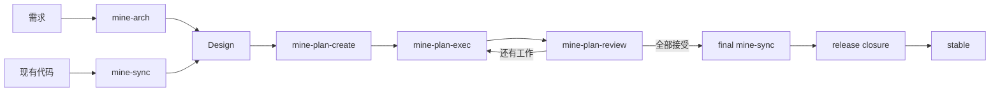

<h1 align="center">MINE</h1>

<p align="center"><strong>MINE Is Not Everyone's.</strong></p>

<p align="center">
  面向 Coding Agent 的文档驱动软件工程工作流。
</p>

<p align="center">
  <a href="https://github.com/6ixGODD/mine-is-not-everyones/blob/master/LICENSE"></a>
  
  
</p>

<p align="center"><a href="README.md">English</a> · <a href="README.zh-CN.md">简体中文</a></p>

---

## MINE 是什么

Coding Agent 擅长完成目标明确、边界清晰的单次任务。然而，软件工程往往不是一次性的对话，而是一个跨越多会话、多阶段、甚至多个并行任务的持续过程。

这一过程中产生的需求、架构决策、实现计划、任务依赖、审查结论以及发布状态，如仅仅停留在聊天上下文中，就会随会话结束而丢失；当多个
Agent 并行工作时，问题会更加突出——每个 Agent 各自持有不完整、甚至相互矛盾的工程认知。

MINE 的解决思路是： **将这些工程状态持久化到仓库中，并用 Git 管理整个开发过程。**

具体而言：

- `docs/design/` 保存当前有效的工程设计；
- `docs/plan/` 保存本轮开发的执行计划；
- execution graph 管理 Plan 之间的依赖和可执行状态；
- Git branch 和 worktree 隔离不同 Plan 的实现；
- 独立 Review 环节决定实现是否可被接受；
- release closure 将最终结果整理回 stable 分支。

MINE 的目标是 **让设计、实现和审查围绕同一份可持久化的工程上下文展开**，从而保证多会话、多 Agent 协作时的信息一致性与过程可追溯性。

## 工作流



五个 Agent Skill 分别承担以下职责：

| Skill              | 用途                                             |
|--------------------|--------------------------------------------------|
| `mine-arch`        | 根据需求创建新的目标 Design，或修改现有 Design   |
| `mine-sync`        | 根据仓库的真实代码状态同步 Design                |
| `mine-plan-create` | 将用户指定范围内的 Design 变更拆成可执行 Plan    |
| `mine-plan-exec`   | 实现某一个 Plan                                  |
| `mine-plan-review` | 独立审查实现，并完成 Plan 的接受、拒绝或发布收口 |

`mine` 二进制负责所有确定性操作，包括但不限于：

* 初始化仓库；
* 管理 Plan 与 execution graph 的状态；
* 管理各 Agent 的集成配置；
* 文件锁与并发状态保护；
* Design / graph 的合法性校验；
* release preflight 检查；
* stable release 前的临时 Plan 引用检查。

日常使用中，无需手工维护 graph revision、report 路径、临时 Plan 分支或 release candidate——均由 MINE 自动管理。

## 安装

### 推荐方式

安装 `mine` 二进制：

#### Windows

在 PowerShell 中执行：

```powershell
irm https://raw.githubusercontent.com/6ixGODD/mine-is-not-everyones/master/scripts/bootstrap.ps1 | iex
```

#### macOS / Linux

在终端中执行：

```sh
curl -fsSL https://raw.githubusercontent.com/6ixGODD/mine-is-not-everyones/master/scripts/bootstrap.sh | sh
```

安装完成后，重新打开终端，验证安装是否成功：

```sh
mine --version
```

将 MINE 安装到你的 Coding Agent：

```sh
mine setup
```

`mine setup` 会为对应的 Agent 配置 Skills，并在客户端支持 MCP 的情况下注册本地 `mine mcp serve`。

如需查看当前 Agent 的集成状态：

```sh
mine agent status
```

### 安装指定版本

默认安装最新 Release。可通过 `MINE_REF` 安装指定版本。

例如，安装 `v0.1.4`：

#### Windows

```powershell
$env:MINE_REF = "v0.1.4"
irm https://raw.githubusercontent.com/6ixGODD/mine-is-not-everyones/master/scripts/bootstrap.ps1 | iex
```

#### macOS / Linux

```sh
MINE_REF=v0.1.4 \
sh -c "$(curl -fsSL https://raw.githubusercontent.com/6ixGODD/mine-is-not-everyones/master/scripts/bootstrap.sh)"
```

`MINE_REF` 对应需要安装的 Git tag，例如 `v0.1.4`。

### Agent 集成

MINE 当前支持的 Agent 及集成方式如下：

| Agent       | Skills |  MCP | 无 MCP 时    |
|-------------|-------:|-----:|--------------|
| Claude Code |     ✓ |   ✓ | CLI fallback |
| Codex       |     ✓ |   ✓ | CLI fallback |
| OpenCode    |     ✓ |   ✓ | CLI fallback |
| Pi          |     ✓ | 可选 | CLI fallback |

Skills 优先通过 MCP 调用 MINE 的确定性接口；当 MCP 不可用时，自动回退到 `mine --format json` CLI 模式。

需要说明的是，Pi 的最小核心本身不包含 MCP 支持。MINE 不要求用户为 Pi 额外安装 MCP adapter，因此 Pi 可以仅使用 Skills + CLI
完成全部操作。

### Claude Code Marketplace

Claude Code 用户也可以通过 Marketplace 安装 MINE Skills：

```text
/plugin marketplace add 6ixGODD/mine-is-not-everyones
/plugin install mine@mine-is-not-everyones
```

Marketplace 安装的是 Claude Code 插件中的 MINE Skills，并不包含 `mine` 二进制本身。

通过 Marketplace 安装后，Claude Code 会以插件命名空间加载这些 Skills，例如：

```text
/mine:mine-arch
```

如果需要完整的状态管理、CLI 和 MCP 能力，仍需通过 bootstrap 安装 `mine` 二进制。

<details>
<summary>从源码安装</summary>

需要 Rust 1.85 及以上版本：

```sh
cargo install --path . --locked
mine setup
```

</details>

## 开始使用

在 Git 仓库根目录执行一次初始化：

```sh
mine init
```

之后，根据仓库当前所处的状态选择合适的起点。

> 下文中的 `mine-arch`、`mine-plan-create`、`mine-plan-exec`、`mine-plan-review` 和 `mine-sync` 均表示调用对应的 Agent
> Skill，而不是 `mine` CLI 的子命令。不同 Coding Agent 的 Skill 调用语法有所不同。

### 场景一：新需求或新的目标设计

先将需求整理进 Design：

```text
mine-arch <你要实现的需求>
```

例如：

```text
mine-arch 为现有认证系统增加 Passkey 登录，并保留当前 session 模型。
```

Design 确定后，将刚才的变更整理成执行计划：

```text
mine-plan-create <需创建执行计划的范围>
```

例如：

```text
mine-plan-create 将刚才确定的 Passkey 登录改动整理为执行计划。
```

随后执行和审查 Plan：

```text
mine-plan-exec <Plan 路径>
mine-plan-review <Plan 路径>
```

当用户已经给出明确 scope 时，`mine-plan-create` 将其作为规划边界，只调查和规划相关的 Design、代码、依赖以及成熟实践，不会默认重新审计整个仓库。

如果直接调用：

```text
mine-plan-create
```

而没有给出任何目标，Skill 才会从当前 Design、execution graph 和仓库状态中寻找下一批需要规划的工作。因此，裸调用通常会比指定
scope 的调用进行更多探索。

### 场景二：已有代码，但尚无可信的 MINE Design

先根据现有代码建立 Design 基线：

```text
mine-sync <需同步的范围>
```

例如：

```text
mine-sync 同步认证、授权和 session 管理相关代码。
```

然后再描述新的目标：

```text
mine-arch 增加 Passkey 登录。
mine-plan-create 将刚才确定的 Passkey 登录变更整理为执行计划。
mine-plan-exec <Plan 路径>
mine-plan-review <Plan 路径>
```

对于大型仓库，建议为 `mine-sync` 指定明确的范围，避免不必要地扫描整个仓库。

## Plan、Git 和并行开发

Plan 是一次实现工作的契约。

每个 Plan 都包含明确的依赖关系、写入范围和验收条件。当需要并行推进多个任务时，不同的 Plan 可以分别使用独立的 branch /
worktree：

```text
dev
├── plan/01-api       → worktree A
├── plan/02-storage   → worktree B
└── plan/03-ui        → worktree C
```

execution graph 用于判断哪些 Plan 的前置依赖已经满足，从而确定哪些 Plan 可以开始执行。

`mine-plan-create` 会根据当前 scope、Design 和依赖关系决定工作应当保持为一个 Plan，还是拆成多个可以串行或并行执行的
Plan。并行本身不是目标：如果拆分只会增加共享文件冲突和协调成本，则应保留为一个完整的工作单元。

一个 Plan 完成实现后，并不会直接进入 `dev` 分支。它必须先经过独立的 Review，只有状态为 `ACCEPTED` 的工作才会被集成。

## 发布

当所有 Plan 均已完成并被接受后，首先同步最终 Design：

```text
mine-sync prepare this repository for stable release
```

这一次 `mine-sync` 用最终代码重新核对持久 Design，确保发布后留下的 `docs/design/` 与实际产品状态一致。

然后执行本地发布收口：

```text
mine-plan-review complete release closure
```

发布收口将依次完成以下工作：

* 验证最终 Design 与实现的一致性；
* 检查 execution graph 与 release gates；
* 构造并验证 stable candidate；
* 检查 stable tree 中是否残留本轮开发的临时 Plan 引用；
* 移除 `docs/plan/` 等临时开发状态；
* 将最终结果集成到 stable 分支；
* 清理 MINE 管理的本地临时分支。

MINE 不会自动执行 push、创建远程 Release 或改写远程历史。这些操作仍由用户自行决定。

## 哪些内容会保留

stable 分支保留以下内容：

```text
代码
docs/design/
用户文档
产品所需的其他文件
```

开发过程中产生的以下内容不会进入 stable release：

```text
docs/plan/
execution graph
implementation / review reports
dev
plan/*
临时 worktree
```

简言之： **Plan 描述的是一次开发过程；Design 描述的是当前有效的工程状态**。前者是过程性的，后者是持久性的。

Plan 编号也只在当前开发周期内有意义。新的开发周期会重新从 Plan 01 开始编号，因此 stable release 不允许在产品代码中残留
`Plan NN` 一类临时引用，以免后续迭代产生歧义。

## 哪些修改不需要 Plan

MINE 管理工程变更，但并非所有仓库修改都需要走完整的生命周期。

以下不改变工程行为的维护性修改通常可以直接进行：

* 错别字修正；
* 翻译更新；
* 文字整理；
* README 和用户文档的更新；
* 坏链接修复；
* 格式调整。

如果修改涉及以下任意内容，建议进入正常的 MINE 流程：

* 运行时行为；
* 架构；
* 公共 API；
* CLI 或 Skill 语义；
* MCP 契约；
* 数据结构或迁移；
* 安全边界；
* 发布行为；
* 其他需要未来工程工作继续遵守的持久设计决策。

判断标准不是"修改了哪种文件"，而是 **是否改变了工程契约**。

## 文档

- [用户指南](docs/user-guide.zh-CN.md) — 按实际操作顺序介绍 MINE 的使用方式
- [核心概念](docs/concepts.zh-CN.md) — 阐释 Design、Plan、execution graph、Review 与 stable 之间的关系

MINE 自身的内部架构与实现契约，参见 [Design index](docs/design/index.md)。

## 当前状态

MINE 目前仍处于早期阶段，并且在设计上有意保持强烈的倾向性。

建议首次使用时，先在可以安全恢复 Git 历史和工作树的仓库中进行试用。

## License

MIT