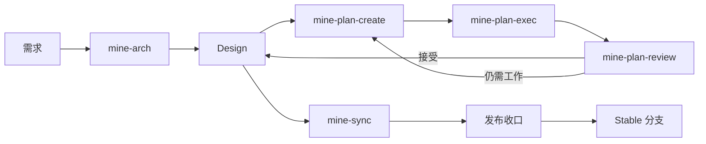

<h1 align="center">MINE</h1>

<p align="center"><strong>MINE Is Not Everyone's.</strong></p>

<p align="center">面向 Claude Code、Codex、Pi 与 OpenCode 的强约束工程工作流。</p>

<p align="center">
  <a href="https://github.com/6ixGODD/mine-is-not-everyones/blob/master/LICENSE"></a>
  
  
</p>

<p align="center"><a href="README.md">English</a> · <a href="README.zh-CN.md">简体中文</a></p>

---

## 为什么需要 MINE

Coding Agent 很擅长解决眼前的一次任务，但真正的软件工程问题更长：架构要跨会话保留下来，代码要对照明确目标实现，并行工作要能协调，审查要独立于实现，稳定分支里最终只应该留下产品，而不是临时 Plan、报告和开发过程。

MINE 给 Coding Agent 提供一套以仓库为中心的工程工作流，用来处理这些长期状态。



五个 Agent Skill 负责工程判断：

| Skill | 什么时候用 |
|---|---|
| `mine-arch` | 定义或修改目标架构 |
| `mine-sync` | 让 Design 重新反映真实代码 |
| `mine-plan-create` | Design 已明确，需要拆成可执行工作包 |
| `mine-plan-exec` | 某个 Plan 已经可以实现 |
| `mine-plan-review` | 实现需要独立审查，或需要完成发布收口 |

Rust 编写的 `mine` 二进制负责确定性状态：仓库初始化、Plan/执行图状态流转、校验、Agent 安装、锁、release preflight，以及原生 stale-reference 扫描。

## 安装

### Windows

```powershell
irm https://raw.githubusercontent.com/6ixGODD/mine-is-not-everyones/master/scripts/bootstrap.ps1 | iex
```

### macOS / Linux

```sh
curl -fsSL https://raw.githubusercontent.com/6ixGODD/mine-is-not-everyones/master/scripts/bootstrap.sh | sh
```

安装后重新打开终端并确认：

```sh
mine --version
mine agent status
```

如需安装指定版本，在执行 bootstrap 前设置 `MINE_REF`。

### Claude Code 插件

```text
/plugin marketplace add 6ixGODD/mine-is-not-everyones
/plugin install mine@mine-is-not-everyones
```

<details>
<summary>从源码安装</summary>

```sh
cargo install --path . --locked
mine setup
```

</details>

## 开始一个项目

在仓库根目录初始化一次：

```sh
mine init
```

然后根据场景选择起点。

**新需求 / 新目标：**

```text
mine-arch <你要构建或修改什么>
mine-plan-create
mine-plan-exec <Plan 路径>
mine-plan-review <Plan 路径>
```

**已有代码库，但还没有可信的 Design 基线：**

```text
mine-sync <大型仓库建议给出范围>
mine-arch <下一项变更>
mine-plan-create
mine-plan-exec <Plan 路径>
mine-plan-review <Plan 路径>
```

按照执行图重复 Execute → Review。正常情况下，你不需要自己管理 graph revision、report 路径、`plan/*` 分支或 `dev` 集成。

所有 Plan 被接受后：

```text
mine-sync prepare this repository for stable release
mine-plan-review complete release closure
```

MINE 负责把本地 release 收口；push 和远程发布仍由用户显式决定。

## 什么会留下，什么会消失

`docs/design/` 是持久工程知识，会留在 stable 分支。

`docs/plan/`、`dev`、`plan/*`、执行报告和 execution graph 都是临时协调状态，只在开发和审查过程中存在，稳定版本不会保留它们。

MINE 也不会强迫每次仓库编辑都创建 Plan。错别字、翻译、文字润色、链接修复、README 整理等明确不改变行为的维护可以直接做；一旦涉及行为、架构、公共契约、Skill、CLI 语义、发布规则、安全边界或其他持久工程决策，就进入 MINE 生命周期。

## 支持的客户端

- Claude Code
- Codex
- Pi
- OpenCode

## 文档

- [用户指南](docs/user-guide.zh-CN.md) — 安装、仓库初始化、日常开发、审查与发布
- [核心概念](docs/concepts.zh-CN.md) — Design、Plan、分支、审查与发布背后的模型

内部架构与实现契约位于英文 [Design index](docs/design/index.md)。

## 当前状态

MINE 仍处于早期阶段，而且有意保持明确的工程倾向。第一次使用时，建议选择一个可以安全恢复 Git 历史和工作树的仓库。

## License

MIT