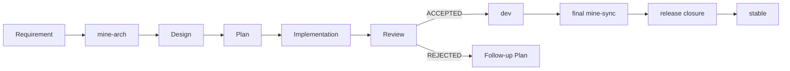
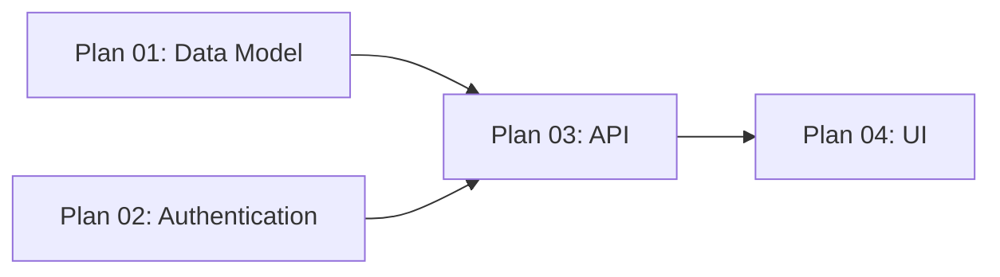
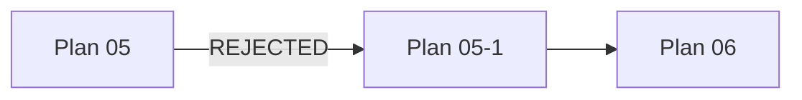
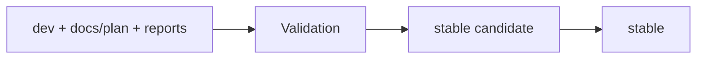

# MINE Core Concepts

MINE is a document-driven software engineering workflow for Coding Agents.

Its core problem is not “how to make an Agent write code,” but **how to keep a software engineering process consistent
across multiple Agents, multiple sessions, and parallel workstreams over days, weeks, or longer**.

MINE separates the engineering process into several distinct kinds of state:

* **Design**: the currently accepted engineering design;
* **Plan**: the execution contract for a specific implementation task;
* **Execution Graph**: dependencies and execution state across Plans;
* **Implementation**: code changes produced according to a Plan;
* **Review**: independent verification that an implementation satisfies its Plan and Design;
* **Stable**: the product state that remains after a development cycle is complete.

These states serve different purposes and should not be collapsed into a single document or a single Agent session.



---

## 1. Design: the currently accepted engineering model

`docs/design/` contains the engineering design currently **accepted** by the repository.

It answers questions such as:

* What components make up the system?
* What is each component responsible for?
* How do components interact?
* Who owns each piece of data or state?
* Which interfaces and behaviors are stable contracts?
* Which constraints and invariants must remain true over time?
* Why does the system use its current design?

Design is neither a requirements list nor a development history.

For example:

```text
User authentication is owned by the auth service.
Sessions are stored in a server-side store.
Refresh token rotation must enforce single use.
```

These facts remain relevant after an individual Plan is complete, so they belong in Design.

### Design and code

Code describes the current implementation. Design describes the currently accepted engineering model.

They should normally agree, but temporary divergence can occur during development:

```text
Design
   │
   │ implementation
   ▼
Code
```

If the implementation has changed and Design has not yet caught up, use `mine-sync` to inspect the code and reconcile
Design.

If the intended system itself needs to change, use `mine-arch` to update the target Design.

In short:

* `mine-arch` answers: “What should the system become next?”
* `mine-sync` answers: “What does the repository actually contain now?”

---

## 2. Why MINE requires external research

Coding Agents can easily produce a design that looks locally reasonable based only on their existing model knowledge.

The problem is that a seemingly reasonable local solution may already have a mature standard, framework, protocol, or
established engineering pattern. Without research, an Agent may reinvent an existing mechanism or introduce a design
that differs unnecessarily from the conventions of the surrounding ecosystem.

MINE therefore **requires** active investigation of established practice during architecture and planning.

Sources should generally be preferred in this order:

1. official documentation;
2. standards and specifications;
3. official source code, examples, and migration guides;
4. mature and widely used open-source projects;
5. primary research;
6. reliable secondary sources when primary material is insufficient.

The purpose is not to copy another project. Research should first answer:

* How is this problem normally solved?
* Is there already a mature abstraction that can be reused?
* What does the current technology stack recommend?
* Which failure modes are already well understood?
* Which mechanisms do not need to be reinvented?

Those findings are then evaluated against the actual constraints of the repository.

### Research in `mine-arch`

`mine-arch` produces durable Design, so its research scope is usually broader.

For example, when designing a task scheduling system, the Agent should first understand established scheduler, queue,
worker, lease, retry, and idempotency patterns before deciding which of them the current project actually needs.

### Research in `mine-plan-create`

`mine-plan-create` does not redesign the whole system, but it still researches mature implementation practice within the
current scope.

For example, suppose Design already states:

```text
Add Passkey login to the authentication system.
```

Planning still needs to determine:

* how the challenge lifecycle is managed;
* how credentials are stored;
* how the current framework integrates with WebAuthn;
* which error and compatibility cases must be handled;
* which behaviors must be covered by tests.

Research during Plan creation is therefore **mandatory but scoped**.

When the user provides an explicit scope:

```text
mine-plan-create Turn the Passkey login changes we just agreed on into an execution plan
```

research stays focused on the Passkey implementation.

If the user invokes:

```text
mine-plan-create
```

without a scope, the Skill must determine the next work to plan from Design, the Execution Graph, and repository state.
Broader exploration may therefore be necessary.

### Research in `mine-sync`

`mine-sync` may also consult external material, but for a different purpose.

Official documentation and standards can help it **understand** technologies, protocols, and libraries found in the
codebase. They must not, however, cause `mine-sync` to rewrite Design toward a supposedly “better” implementation merely
because external best practice differs from the current repository.

When synchronizing current state, the authority order is:

```text
Explicit user instructions
    >
Current repository reality
    >
Existing Design
```

External material helps interpret reality; it does not replace reality.

---

## 3. Plan: an execution contract for one implementation task

Design defines engineering intent, but it is usually not detailed enough to hand directly to a Coding Agent for
implementation.

For example, Design may state:

```text
The storage layer uses optimistic concurrency control.
```

Implementation still needs to know:

* which files must change;
* where the revision is stored;
* how a revision conflict is reported;
* whether retries are allowed;
* which tests must be added;
* whether concurrent modification is possible;
* how the final behavior is verified.

Those details belong in a Plan.

A Plan turns part of Design into a unit of work that can be executed and reviewed independently.

A Plan typically includes:

* the scope of the work;
* the relevant Design;
* predecessor dependencies;
* allowed write scope;
* implementation goals;
* important behavior and edge cases;
* acceptance criteria;
* verification steps.

### The boundary between planning and architecture changes

If `mine-plan-create` discovers that implementing the current requirement requires changing:

* product behavior;
* architectural boundaries;
* a public API;
* persistence semantics;
* a security boundary;
* an ownership model;
* another engineering contract that must remain durable;

then the existing Design is not sufficient for the implementation.

The new architectural decision must not simply be written into the Plan.

`mine-plan-create` may invoke `mine-arch` itself, analyze the impact, update the relevant Design, and then continue
planning. The user does not need to switch Skills manually.

The important boundary is not **who invokes `mine-arch`**, but that **all durable engineering decisions enter Design
before they enter a Plan**.

A Plan may resolve local implementation details, but it **must not silently modify durable engineering contracts**.

---

## 4. Why a Plan becomes immutable once execution starts

A Plan is the shared basis for both Implementation and Review.

Suppose a Plan keeps changing during implementation:

```text
Plan v1
   ↓
Implementation starts
   ↓
Plan v2
   ↓
Implementation continues
   ↓
Plan v3
   ↓
Review
```

The Reviewer can no longer reliably answer:

**Which version of the requirements does this implementation actually satisfy?**

Once execution begins, the Plan is therefore no longer modified in place.

If a material problem is discovered, new follow-up work should be created explicitly rather than rewriting history.

This keeps:

```text
The same Plan
    ↓
Implementation
    ↓
Review
```

anchored to the same contract.

---

## 5. Execution Graph: managing dependencies between Plans

A requirement may be decomposed into multiple Plans.

For example:



Plan 03 cannot start until Plan 01 and Plan 02 have both been accepted.

The Execution Graph records:

* each Plan’s current state;
* hard predecessors;
* which Plans are `READY`;
* which Plans remain `BLOCKED`;
* which Plans may execute in parallel.

This moves execution order out of an Agent’s conversational memory and into deterministic repository state.

Common states include:

```text
DRAFT
READY
BLOCKED
IN_PROGRESS
IMPLEMENTED
ACCEPTED
REJECTED
```

Users normally do not edit the Execution Graph manually. Skills update it through MINE’s MCP or CLI interfaces.

---

## 6. Plans, branches, and worktrees

MINE uses Git branches and worktrees to isolate implementation work for different Plans.

For example:

```text
stable
  │
  └── dev
       ├── plan/01-api       → worktree A
       ├── plan/02-storage   → worktree B
       └── plan/03-ui        → worktree C
```

Each Plan has its own write scope.

If Plan 01 and Plan 02:

* have no hard dependency between them;
* do not primarily modify conflicting files;

they can be executed in parallel by different Agents in separate worktrees.

The Execution Graph determines whether dependencies allow parallel execution. A Plan’s write scope reduces the risk of
multiple Agents modifying the same files at the same time.

### Parallelism is not the goal

MINE does not split work merely to maximize the number of Agents.

If splitting one task into three Plans means that they:

* repeatedly modify the same files;
* share the same interfaces;
* depend on one another step by step;
* create more coordination cost than parallel execution saves;

then one coherent Plan is the better choice.

Parallelism is used only when work can genuinely progress independently.

---

## 7. Implementation and Review must be isolated

`mine-plan-exec` implements a Plan.

After implementation, the Plan may advance only as far as:

```text
IMPLEMENTED
```

The Implementation Agent **cannot** mark its own work as:

```text
ACCEPTED
```

Acceptance belongs to an independent `mine-plan-review`.

The Reviewer re-examines:

* the Plan;
* the relevant Design;
* the actual code;
* tests and verification evidence;
* repository-defined quality gates.

### Why Review must be independent

This is not about having two Agents role-play different personas.

The two operations are fundamentally different:

```text
Produce a change
```

and:

```text
Determine whether the change satisfies the contract
```

During implementation, the Executor develops its own explanations, assumptions, and judgments about the code. If Review
continues in exactly the same context, those assumptions are likely to be inherited rather than challenged.

Implementation and Review should therefore run in at least two independent Agent sessions.

For example:

```text
Codex session A
    ↓
mine-plan-exec

Codex session B
    ↓
mine-plan-review
```

Different Agents may also be used:

```text
Claude Code
    ↓
mine-plan-exec

Codex
    ↓
mine-plan-review
```

The important point is not which Agent is used, but that **the Reviewer does not inherit the Executor’s implementation
context**.

Avoid:

```text
Same session
    ↓
mine-plan-exec
    ↓
continue in the same context
    ↓
mine-plan-review
```

For important Plans, a fresh Review session is recommended.

A single Reviewer session may review multiple related Plans, as long as it does not share implementation context with
the corresponding Executors.

### Can the Reviewer modify code directly?

Yes, within clear limits.

A Reviewer may directly fix an issue when:

* the issue is local;
* the correct behavior is already uniquely determined by accepted Design;
* the change has a clear boundary;
* the result can be fully re-verified.

If the problem is not a local implementation defect but instead requires changing an assumption in the Plan or Design,
it cannot be resolved merely through a review patch.

The Reviewer may then invoke `mine-arch` to update the relevant Design.

The original Plan is not rewritten retroactively. New work is created against the updated engineering target.

---

## 8. What happens after a Plan is REJECTED

`REJECTED` means the current Plan cannot be accepted as an execution contract and new engineering work is required.

Common reasons include:

* the implementation chose the wrong core approach;
* an important assumption in the Plan no longer holds;
* Review reveals that Design must change;
* the implementation cannot be safely corrected within the original Plan scope.

A compensating Plan is typically created.

For example:

```text
Plan 05
    ↓ IMPLEMENTED
mine-plan-review
    ↓ REJECTED
Plan 05-1
```

The compensating Plan defines a new execution contract. The original Plan 05 remains `REJECTED`.

MINE does not rewrite the original Plan to pretend that the correct approach had been there all along.

### How the Execution Graph handles a compensating Plan

Suppose the original graph contains:

```text
Plan 06
hard predecessors:
    04
    05
```

Plan 05 is rejected and produces:

```text
Plan 05-1
```

If Plan 06 depended on the result Plan 05 was supposed to deliver, its dependency must become:

```text
Plan 06
hard predecessors:
    04
    05-1
```

This process is called compensation rewiring.



MINE updates the Execution Graph so downstream work depends on the compensating Plan rather than the failed one.

`REJECTED` is therefore not merely a status label. It also affects downstream dependencies and which work may become
executable.

---

## 9. `dev` and stable

MINE separates the integration state of an active development cycle from the final product state.

### `dev`

`dev` contains work that has already been accepted during the current development cycle.

As Plans are reviewed and accepted:

```text
Plan 01
    ↓ ACCEPTED
dev

Plan 02
    ↓ ACCEPTED
dev

Plan 03
    ↓ ACCEPTED
dev
```

`dev` therefore represents how far the current development cycle has progressed in accepted work.

### stable

stable represents the state that the next development cycle and end users should inherit.

It does not need to retain every intermediate artifact used to produce that state.

For this reason, release does not simply carry the entire `dev` development history into stable unchanged.

---

## 10. Why `docs/design/` remains while `docs/plan/` is removed

The two directories contain information with different lifetimes.

### Design

`docs/design/` describes the currently valid system.

The next development cycle still needs that information, so it remains with the product in stable.

### Plan

`docs/plan/` describes the current development cycle:

* what needs to be done;
* which work depends on which other work;
* which Plan is currently running;
* which Plans have been accepted;
* what the implementation and review reports contain.

Once the development cycle is complete, this information is no longer part of the current engineering state.

If every Plan, graph, and report remained permanently in stable, a future Agent looking for the current Design would
first have to navigate large amounts of expired process state.

Therefore:

```text
stable
├── code
└── docs/design/
```

while:

```text
docs/plan/
execution graph
reports
plan/*
temporary worktrees
```

belong to development-time state.

---

## 11. Why stable must not contain `Plan NN` references

MINE Plan numbers are unique only within the current development cycle.

For example, one cycle may contain:

```text
Plan 01
Plan 02
Plan 03
```

and the next cycle may again begin with:

```text
Plan 01
Plan 02
Plan 03
```

If product code permanently contains:

```text
// Plan 03: retry after revision conflict
```

then once another Plan 03 exists in a later cycle, the comment no longer has an unambiguous referent.

This affects:

* human readability;
* Agent understanding;
* Code Review;
* references from future Plans.

Plan numbers may be used temporarily during development to explain current work, but stable release checks that product
code no longer contains these temporary references.

Final code should explain **why the code behaves this way**, not **which Plan once produced it**.

---

## 12. Final Sync and Release Closure

Having every Plan in `ACCEPTED` means only that **all planned work has been implemented and reviewed**. It does not
automatically prove that `docs/design/` accurately describes the final codebase.

Implementation may have introduced:

* local Reviewer fixes;
* implementation details not specified by the original Design;
* newly discovered constraints;
* final state that only becomes visible after multiple Plans are integrated.

Release therefore has two stages.

### Final Sync

First run:

```text
mine-sync prepare this repository for stable release
```

This compares the final implementation with Design and writes durable engineering knowledge back into `docs/design/`.

Final Sync answers:

**Does the code about to enter stable still match the durable Design?**

### Release Closure

After Final Sync, run:

```text
mine-plan-review complete release closure
```

Release Closure turns development state into stable product state.



Release Closure checks that:

* the Execution Graph has reached a terminal state;
* all required Plans are complete;
* final Design synchronization has occurred;
* release gates pass;
* the stable candidate is valid;
* product code contains no temporary Plan references from the current cycle.

After successful closure:

* the final product state enters stable;
* `docs/design/` remains;
* `docs/plan/` and execution reports are removed;
* MINE-managed temporary development branches and worktrees are cleaned up.

Remote push, Git tags, GitHub Releases, and other remote publishing operations remain under user control.

---

## 13. Which changes require the full MINE lifecycle

MINE manages engineering change. It does not require every file edit to create a Plan.

For example:

* fixing a typo;
* updating a translation;
* editing README text;
* repairing a link;
* adjusting formatting;

can be done directly when they do not change engineering behavior.

However, if a change modifies something future development must continue to obey, such as:

* architecture;
* runtime behavior;
* public APIs;
* CLI or Skill semantics;
* MCP contracts;
* data models;
* security boundaries;
* release rules;

then it is an engineering contract change even if the edit itself happens in a Markdown file, and it should follow the
normal Design → Plan → Execute → Review lifecycle.

The deciding question is not which file type changed, but:

> **Does this change modify an engineering decision that must remain durable?**

For the concrete operating sequence, see the [User Guide](user-guide.md).
