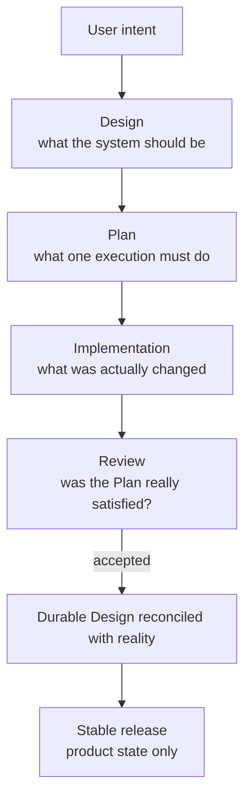
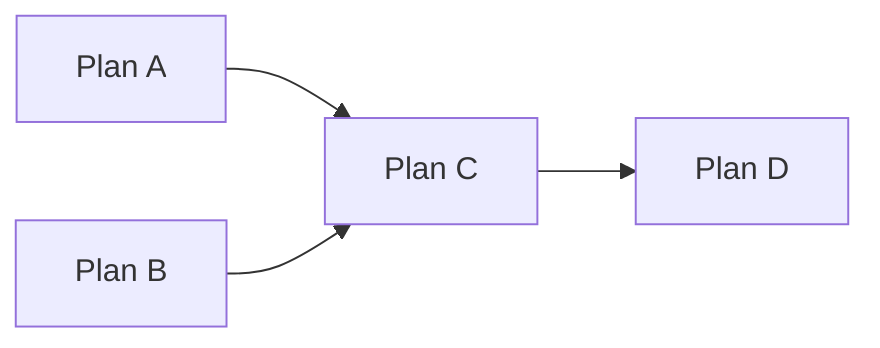
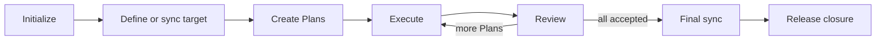

# MINE Concepts

MINE is easier to use once you stop thinking of it as “a collection of commands” and start thinking of it as a way to keep engineering intent alive across many coding-agent sessions.

The core problem is simple: agents operate in conversations, but software lives longer than conversations. A repository therefore needs durable answers to four questions:

1. What is the system supposed to be?
2. What exact work is being executed now?
3. Who verified that work independently?
4. What state is allowed to become stable?

MINE gives each answer a different home.



## Design is the long-lived engineering memory

`docs/design/` is not a backlog and not a transcript of previous conversations. It records the accepted engineering model of the repository: architecture, interfaces, invariants, ownership boundaries, operational behavior, and other decisions that future work must understand.

That distinction matters because code alone often cannot answer why a boundary exists or which future direction is intentional. Conversely, Design is not allowed to become mythology: when implementation and Design drift, `mine-sync` forces the discrepancy back into view.

A useful way to think about it is:

- code answers **what currently executes**;
- Design answers **what the repository currently accepts as its engineering model**;
- user instruction can intentionally move the target forward.

`mine-arch` works primarily from intent toward target Design. `mine-sync` works primarily from repository evidence toward an accurate Design baseline.

## A Plan is an execution contract, not planning prose

Once the target is clear, an agent still needs a bounded unit of work. That is the Plan.

A good Plan fixes enough facts that another agent can execute it without reopening the architectural decision: scope, relevant Design, dependencies, write boundaries, acceptance criteria, and verification.

That is why a Plan becomes immutable once execution starts. If you rewrite the job after someone has begun doing it, the implementation and its review no longer refer to the same contract.

When a material assumption turns out to be wrong, MINE does not pretend the original Plan was always different. The old Plan remains evidence of what was attempted; new work is represented explicitly.

## The execution graph answers “what can run now?”

Multiple Plans may depend on one another. MINE represents that as an execution graph rather than relying on an Agent to remember ordering from prose.



A and B can execute independently if their write scopes allow it. C cannot start until its hard predecessors are accepted. The graph therefore turns workflow state into something deterministic rather than conversational.

Most users do not need to manipulate this graph directly. Skills use the CLI/MCP state machine to do that safely.

## Implementation and acceptance are deliberately different acts

An implementation agent can produce convincing code and still be wrong about whether it satisfied the Plan. MINE therefore stops implementation at `IMPLEMENTED`.

Acceptance belongs to an independent review session.

The reviewer does more than ask whether tests are green. It checks the submitted implementation against the Plan, Design, repository evidence, and applicable quality gates. If the right correction is already unambiguous and small, the reviewer may fix it directly and revalidate. If accepting the work would require changing the contract itself, the work is not ready to accept.

The point is not role-play between two personas. The point is that the claim “this work is complete” should be made from a fresh inspection context rather than by the process that just produced the work.

## `dev` is integration state; stable is product state

MINE intentionally separates the active development cycle from the stable branch.

During development:

```text
stable
  └─ dev
      ├─ docs/plan/
      ├─ plan branches
      ├─ execution graph
      └─ implementation/review evidence
```

`dev` answers: **what accepted work has accumulated in this active cycle?**

The stable branch answers a different question: **what product state do we want future users and future development to inherit?**

That is why release closure does not simply merge all temporary history into stable. It validates the final tree and performs a curated integration. The stable branch keeps the resulting code and durable Design, not the scaffolding used to produce them.

## Why `docs/plan/` disappears but `docs/design/` remains

This is the cleanest expression of the Design/Plan distinction.

A Plan is useful because work is unfinished. After the work is accepted, the Plan has served its operational purpose. Keeping every temporary Plan, report, graph transition, and implementation branch in stable would make future agents wade through process history to discover current truth.

Design is different. Future work still needs it.

So release closure removes temporary coordination state and keeps durable engineering knowledge.

## Why release needs a final sync

Even a well-written Plan cannot predict every implementation detail. Review may introduce a narrow correction; reality may reveal a constraint that the pre-implementation Design did not fully capture.

Therefore “all Plans are accepted” is not enough to prove that durable Design describes the final repository.

Before release, Phase A runs:

```text
mine-sync prepare this repository for stable release
```

This asks one final question: **if a new session starts from this repository, will its durable Design describe the product we are actually about to release?**

Only after that does Phase B perform mechanical release closure.

## Not every edit is an engineering lifecycle

MINE exists to preserve engineering intent, not to manufacture ceremony.

If you correct a typo, translate a paragraph, repair a link, or rewrite user documentation without changing the behavior it describes, there is usually no architectural decision to preserve and no execution contract worth creating. Do the edit directly.

Use the full lifecycle when the change affects something future engineering work must treat as a contract: runtime behavior, architecture, public APIs, CLI or Skill semantics, persistence, security boundaries, deployment, release behavior, or another durable decision.

The dividing line is not the file extension. A one-line documentation edit can establish a new contract; a hundred-line prose rewrite can be purely editorial.

## The practical mental model

For day-to-day use, reduce MINE to this:



You decide intent and retain publication authority. The Skills perform engineering judgment. The `mine` binary makes state transitions and validation deterministic.

That separation is the whole system.