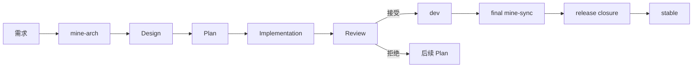
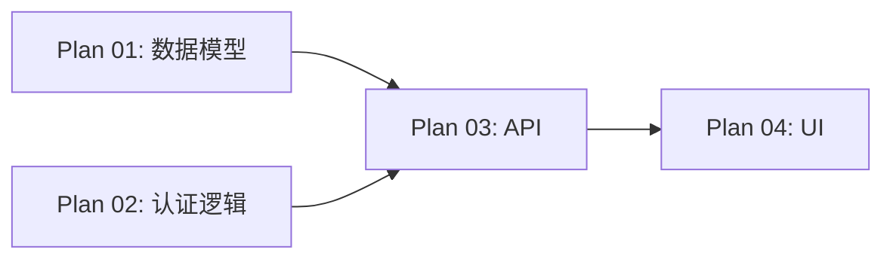
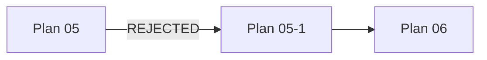
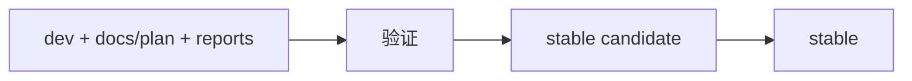

# MINE 核心概念

MINE 是一套面向 Coding Agent 的文档驱动软件工程工作流。

它解决的核心问题不是“如何让 Agent 写代码”，而是 **如何让一个持续数天、数周甚至更久的软件工程过程，在多个
Agent、多个会话和多个并行任务之间始终保持一致**。

MINE 将工程过程划分为几类性质不同的状态：

* **Design**：当前有效的工程设计；
* **Plan**：一次具体实现工作的执行契约；
* **Execution Graph**：Plan 之间的依赖与执行状态；
* **Implementation**：按照 Plan 产生的代码修改；
* **Review**：独立验证实现是否满足 Plan 与 Design；
* **Stable**：完成一轮开发后可以保留下来的产品状态。

这些状态分别解决不同的问题，不应混在同一份文档或同一次 Agent 会话中。



---

## 1. Design：记录当前有效的工程设计

`docs/design/` 保存的是当前仓库 **已经接受**的工程设计。

它主要回答：

* 系统由哪些部分组成；
* 各部分分别承担什么职责；
* 模块之间如何交互；
* 数据和状态由谁拥有；
* 哪些接口或行为属于稳定契约；
* 哪些约束和不变量必须长期成立；
* 为什么当前系统采用这样的设计。

Design 既不是需求列表，也不是开发历史。

例如：

```text
用户认证由 auth service 负责。
session 由 server-side store 持有。
refresh token rotation 必须保证单次使用。
```

这些内容即使某个 Plan 已经完成，下一轮开发仍然需要知道，因此应该留在 Design 中。

### Design 与代码的关系

代码描述当前实现，Design 描述当前被接受的工程模型。

二者通常应保持一致，但在实际开发中可能暂时出现差异：

```text
Design
   │
   │ implementation
   ▼
Code
```

如果实现已经发生变化而 Design 尚未同步，使用 `mine-sync` 重新核对代码并更新 Design。

如果目标本身需要发生变化，则使用 `mine-arch` 修改目标 Design。

因此：

* `mine-arch` 处理的是“系统接下来应该变成什么”；
* `mine-sync` 处理的是“当前仓库实际上已经是什么”。

---

## 2. MINE 为什么要求外部研究

Coding Agent 很容易根据已有模型知识直接产生一个看起来合理的方案。

问题在于，一个局部看似合理的设计，很可能早已存在成熟的标准、框架、协议或工程模式。如果不进行调查，Agent
很容易重新发明已经存在的机制，或者采用一个与当前生态惯例完全不同的方案。

因此，MINE 在架构和规划阶段 **要求**主动了解已有实践。

通常按以下优先级参考：

1. 官方文档；
2. 标准与规范；
3. 官方源码、示例和迁移文档；
4. 成熟且广泛使用的开源项目；
5. 原始研究；
6. 必要时再参考可靠的二手资料。

研究的目的不是照搬其他项目，而是先回答：

* 这个问题通常是如何解决的；
* 是否已有成熟抽象可以直接采用；
* 当前技术栈推荐什么方式；
* 哪些失败模式已经被反复验证；
* 哪些东西没有必要重新设计。

然后再结合当前仓库的实际约束作出决策。

### `mine-arch` 中的研究

`mine-arch` 负责形成持久 Design，因此研究范围通常更广。

例如设计一套任务调度机制时，需要先了解已有的 scheduler、queue、worker、lease、retry、idempotency 等成熟模式，再决定当前项目真正需要其中哪些部分。

### `mine-plan-create` 中的研究

`mine-plan-create` 不重新设计整个系统，但仍然需要研究当前 scope 内的成熟实现方式。

例如 Design 已经决定：

```text
认证系统增加 Passkey 登录。
```

Plan 阶段仍然需要确定：

* challenge 生命周期如何管理；
* credential 如何保存；
* 当前框架如何接入 WebAuthn；
* 哪些错误与兼容性情况必须处理；
* 测试应该覆盖哪些行为。

因此，Plan Create 的研究是 **强制但有范围**的。

当用户指定了明确 scope 时：

```text
mine-plan-create 将刚才确定的 Passkey 登录改动整理为执行计划
```

研究只围绕 Passkey 相关实现展开。

如果直接调用：

```text
mine-plan-create
```

而未提供 scope，Skill 才需要从 Design、execution graph 和仓库状态中自行确定下一批应被规划的工作，此时探索范围可能更大。

### `mine-sync` 中的研究

`mine-sync` 也可以查阅外部资料，但目的不同。

它可以通过官方文档或标准来 **理解**代码中出现的技术、协议和库，但不能因为外部最佳实践与当前代码不同，就把 Design
改成“更理想”的实现。

对于同步现状，优先级如下：

```text
用户明确指令
    >
当前仓库事实
    >
已有 Design
```

外部资料用于 **理解事实**，不能替代事实。

---

## 3. Plan：一次实现工作的执行契约

Design 定义工程目标，但 Design 本身通常不足以直接交给一个 Coding Agent 实现。

例如 Design 可能写：

```text
storage layer 使用 optimistic concurrency control。
```

真正实现仍然需要知道：

* 哪些文件要修改；
* revision 存在哪里；
* revision conflict 如何返回；
* 是否重试；
* 哪些测试必须增加；
* 是否存在并行修改；
* 如何验证最终结果。

这些内容属于 Plan 的范畴。

Plan 将 Design 中的某一部分转换成一个可独立执行和审查的工作单元。

一个 Plan 通常包含：

* 本次工作的 scope；
* 对应的 Design；
* 前置依赖；
* 可修改的文件范围；
* 实现目标；
* 关键行为和边界条件；
* 验收标准；
* 验证方式。

### Plan 与架构变更的边界

如果 `mine-plan-create` 在规划过程中发现，实现当前需求必须改变：

* 产品行为；
* 架构边界；
* 公共 API；
* 数据持久化语义；
* 安全边界；
* 所有权模型；
* 其他需要长期遵守的工程契约；

这说明现有 Design 已经不足以支撑本次实现。

此时不能直接把新的架构决策写进 Plan。

`mine-plan-create` 可以主动调用 `mine-arch`，先分析影响范围并更新相关 Design，再继续生成 Plan。这个过程不要求用户手工切换
Skill。

重要的边界不是“由谁调用 `mine-arch`”，而是： **所有持久工程决策都必须先进入 Design，再进入 Plan。**

Plan 可以决定局部实现细节，但 **不能静默修改持久工程契约**。

---

## 4. 为什么 Plan 开始执行后不再修改

Plan 同时是 Implementation 和 Review 的共同依据。

假设一个 Plan 在实现过程中不断被修改：

```text
Plan v1
   ↓
开始实现
   ↓
Plan v2
   ↓
继续实现
   ↓
Plan v3
   ↓
Review
```

那么 Reviewer 最终很难判断： **当前实现到底是在满足哪一个版本的要求？**

因此，Plan 一旦进入执行阶段，就不再原地修改。

如果发现原计划存在实质问题，应显式产生后续工作，而不是改写历史。

这样可以保证：

```text
同一份 Plan
    ↓
Implementation
    ↓
Review
```

始终针对同一个契约。

---

## 5. Execution Graph：管理 Plan 之间的依赖

一个需求可能被拆成多个 Plan。

例如：



Plan 03 必须等 Plan 01 和 Plan 02 被接受以后才能开始。

Execution graph 用来记录：

* Plan 当前状态；
* hard predecessor；
* 哪些 Plan 已经 READY；
* 哪些 Plan 仍然 BLOCKED；
* 哪些 Plan 可以并行执行。

它将执行顺序从 Agent 自己的聊天记忆中移出来，变成仓库中的确定性状态。

常见状态包括：

```text
DRAFT
READY
BLOCKED
IN_PROGRESS
IMPLEMENTED
ACCEPTED
REJECTED
```

普通使用者通常无需手工编辑 execution graph。Skill 通过 MINE 的 MCP 或 CLI 接口修改这些状态。

---

## 6. Plan、branch 和 worktree

MINE 使用 Git branch 和 worktree 隔离不同 Plan 的实现。

例如：

```text
stable
  │
  └── dev
       ├── plan/01-api       → worktree A
       ├── plan/02-storage   → worktree B
       └── plan/03-ui        → worktree C
```

每个 Plan 有自己的写入范围。

如果 Plan 01 和 Plan 02：

* 没有 hard dependency；
* 修改的主要文件不存在冲突；

那么它们可以由不同 Agent 在不同 worktree 中并行执行。

Execution graph 负责判断依赖是否允许并行，Plan 的 write scope 则用于降低多个 Agent 同时修改相同文件的风险。

### 并行不是目标

MINE 不会为了“多 Agent”而强行拆分任务。

如果一个工作拆成三个 Plan 后：

* 需要频繁修改同一个文件；
* 共享同一套接口；
* 每一步都依赖前一步；
* 增加的协调成本高于并行收益；

那么保持一个完整 Plan 更为合适。

并行只用于真正可以独立推进的工作。

---

## 7. Implementation 与 Review 必须隔离

`mine-plan-exec` 负责实现 Plan。

执行完成后，Plan 最多进入：

```text
IMPLEMENTED
```

Implementation Agent **不能**自行将自己的工作标记为：

```text
ACCEPTED
```

Acceptance 由独立的 `mine-plan-review` 完成。

Reviewer 会重新检查：

* Plan；
* 相关 Design；
* 实际代码；
* 测试与验证证据；
* 仓库规定的质量门槛。

### 为什么需要独立 Review

这里并不是为了让两个 Agent 进行角色扮演。

需要分离的是两个本质上不同的动作：

```text
产生修改
```

和：

```text
确认修改已经满足要求
```

Executor 在实现过程中已经形成了一套关于当前代码的解释、假设和判断。如果 Review 继续使用完全相同的上下文，这些假设很容易被直接继承。

因此，Implementation 与 Review 至少应运行在两个独立的 Agent session 中。

例如：

```text
Codex session A
    ↓
mine-plan-exec

Codex session B
    ↓
mine-plan-review
```

也可以使用不同 Agent：

```text
Claude Code
    ↓
mine-plan-exec

Codex
    ↓
mine-plan-review
```

关键不是使用哪一种 Agent，而是 **Reviewer 不应继承 Executor 的执行上下文**。

不建议：

```text
同一个 session
    ↓
mine-plan-exec
    ↓
继续在原上下文中
    ↓
mine-plan-review
```

对于重要 Plan，建议使用新的 Review session。

同一个 Reviewer session 也可以连续审查多个相关 Plan，但它仍然不能与对应的 Executor 共享实现上下文。

### Reviewer 是否可以直接修改代码

可以，但有明确边界。

如果问题是：

* 局部的；
* 正确答案已经被 accepted Design 唯一确定；
* 修改范围明确；
* 可以重新验证；

Reviewer 可以直接修正并重新检查。

如果 Reviewer 发现问题并非局部实现错误，而是现有 Plan 或 Design 的前提本身需要改变，则不能仅通过一个 review patch 解决。

此时 Reviewer 可以主动调用 `mine-arch` 更新相关 Design。

Design 更新后，原 Plan 不会被事后改写；当前工作应按照新的工程目标产生明确的后续执行契约。

---

## 8. Plan 被 REJECTED 之后

`REJECTED` 表示当前 Plan 作为执行契约不能被接受，需要产生新的工程工作。

常见情况包括：

* 实现采用了错误的核心方案；
* 原 Plan 的重要假设已经不成立；
* Review 发现必须修改 Design；
* 当前实现无法在原 Plan 范围内安全修正。

此时通常会创建一个补偿 Plan。

例如：

```text
Plan 05
    ↓ IMPLEMENTED
mine-plan-review
    ↓ REJECTED
Plan 05-1
```

补偿 Plan 描述新的执行契约，原 Plan 05 则继续保持 `REJECTED`。

MINE 不会把原 Plan 修改成“其实第一次就应该这样做”。

### Execution Graph 如何处理补偿 Plan

假设原来：

```text
Plan 06
hard predecessors:
    04
    05
```

Plan 05 被拒绝后创建：

```text
Plan 05-1
```

而 Plan 06 依赖的是 Plan 05 原本应该交付的结果，那么它的依赖需要改为：

```text
Plan 06
hard predecessors:
    04
    05-1
```

这个过程称为 compensation rewiring。



MINE 会更新 execution graph，使后续 Plan 依赖新的补偿工作，而不是继续依赖已经失败的 Plan。

因此，REJECTED 不只是一个状态标记，它还会影响后续工作的依赖关系和可执行状态。

---

## 9. `dev` 与 stable

MINE 区分开发中的集成状态和最终产品状态。

### `dev`

`dev` 保存当前开发周期中已经被接受的工作。

随着 Plan 被 Review 并接受：

```text
Plan 01
    ↓ ACCEPTED
dev

Plan 02
    ↓ ACCEPTED
dev

Plan 03
    ↓ ACCEPTED
dev
```

因此 `dev` 表示：当前这一轮开发已经接受到什么程度。

### stable

stable 表示：下一轮开发和最终用户应该继承什么状态。

stable 不需要保留生产这些结果时产生的所有中间过程。因此发布时不会简单地把整个 `dev` 开发历史原样带入 stable。

---

## 10. 为什么 `docs/design/` 保留，而 `docs/plan/` 删除

两者保存的信息具有不同的生命周期。

### Design

`docs/design/` 描述当前有效的系统。

下一轮开发仍然需要它，因此随产品一起进入 stable。

### Plan

`docs/plan/` 描述当前这一轮开发过程：

* 做什么；
* 谁依赖谁；
* 哪个 Plan 正在执行；
* 哪个 Plan 已经接受；
* 实现和审查报告是什么。

一轮开发完成后，这些信息不再是当前工程状态的一部分。

如果每一轮的 Plan、graph、reports 都永久留在 stable 中，下一次 Agent 想寻找“当前有效设计”时，就必须先穿过大量已经失效的过程信息。

因此：

```text
stable
├── code
└── docs/design/
```

而：

```text
docs/plan/
execution graph
reports
plan/*
temporary worktrees
```

属于开发期状态。

---

## 11. 为什么 stable 不允许残留 `Plan NN`

MINE 的 Plan 编号只在当前开发周期内唯一。

例如第一轮：

```text
Plan 01
Plan 02
Plan 03
```

下一轮重新开始时仍可能是：

```text
Plan 01
Plan 02
Plan 03
```

因此，如果代码中永久留下：

```text
// Plan 03: retry after revision conflict
```

下一轮开发再出现 Plan 03 时，这条注释已经无法确定指向哪一次开发。

这会同时影响：

* 人类阅读；
* Agent 理解；
* Code Review；
* 后续 Plan 的引用。

所以开发过程中可以暂时使用 Plan 编号解释当前工作，但 stable release 会检查产品代码中是否仍残留这类临时引用。

最终代码应该解释 **为什么代码这样工作**，而不是解释 **它曾经属于哪个 Plan**。

---

## 12. Final Sync 与 Release Closure

所有 Plan 都 `ACCEPTED`，只说明： **所有计划中的工作已经被实现和审查**。它不能自动证明最终 `docs/design/` 已经准确描述现在的代码。

实现过程中可能出现：

* Reviewer 的局部修正；
* 原 Design 没有规定的实现细节；
* 代码暴露出来的新约束；
* 多个 Plan 集成后的最终状态。

因此发布分为两个阶段：

### Final Sync

首先执行：

```text
mine-sync prepare this repository for stable release
```

这一步重新比较最终代码和 Design，并把发布后仍然需要保留的工程知识同步回 `docs/design/`。

Final Sync 解决的是： **即将进入 stable 的代码，与持久 Design 是否一致？**

### Release Closure

Final Sync 完成后，再执行：

```text
mine-plan-review complete release closure
```

Release closure 负责把开发状态整理成 stable 产品状态。



发布收口主要检查：

* execution graph 是否已经结束；
* 所有需要接受的 Plan 是否完成；
* 最终 Design 是否已经同步；
* release gates 是否通过；
* stable candidate 是否正确；
* 产品代码中是否残留当前周期的临时 Plan 引用。

通过后：

* 最终产品状态进入 stable；
* `docs/design/` 保留；
* `docs/plan/` 和执行报告删除；
* MINE 管理的临时开发 branch/worktree 被清理。

远程 push、Git tag、GitHub Release 或其他发布操作仍由用户决定。

---

## 13. 哪些修改需要完整 MINE 生命周期

MINE 的目标是管理工程变化，而不是要求所有文件修改都创建 Plan。

例如：

* 修正错别字；
* 更新翻译；
* 修改 README；
* 修复链接；
* 调整格式；

如果它们不改变工程行为，可以直接修改。

但如果修改改变了未来开发必须遵守的内容，例如：

* 架构；
* 运行时行为；
* 公共 API；
* CLI / Skill 语义；
* MCP 契约；
* 数据模型；
* 安全边界；
* 发布规则；

即使修改本身发生在 Markdown 文件中，也属于工程契约变化，应进入正常的 Design → Plan → Execute → Review 流程。

因此判断标准不是文件类型，而是：

> **这次修改是否改变了需要长期保存的工程决策。**

具体操作顺序见 [用户指南](user-guide.zh-CN.md)。
