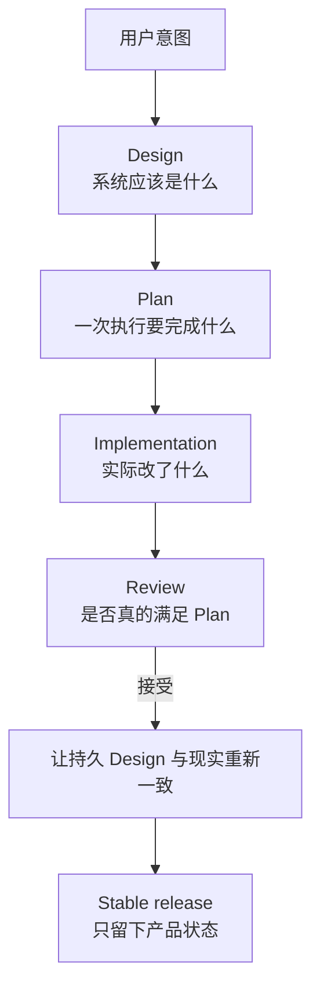
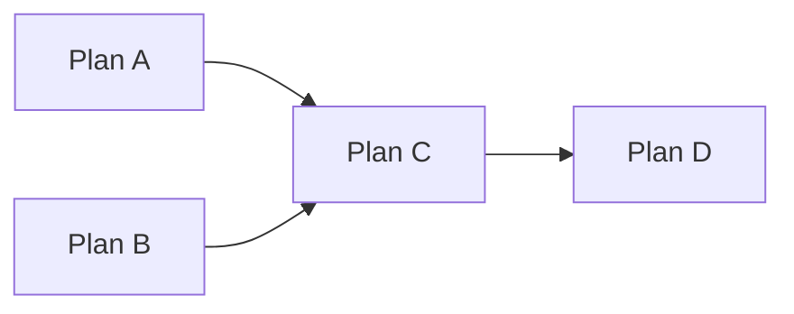

# MINE 核心概念

如果把 MINE 看成一堆命令，它会显得很繁琐。更准确的理解是：**MINE 用来让工程意图跨越多个 Coding Agent 会话继续存在。**

Agent 活在一次次对话里，软件却活得比对话久得多。因此，一个仓库至少要长期回答四个问题：

1. 这个系统应该是什么样？
2. 眼前这次执行到底要做什么？
3. 谁独立确认它真的做对了？
4. 哪一种状态才允许进入 stable？

MINE 把这四类问题分开放，而不是全塞进一份聊天记录或 README。



## Design 是长期工程记忆

`docs/design/` 不是 backlog，也不是历史聊天记录。它保存的是仓库当前已经接受的工程模型：架构、接口、约束、不变量、所有权边界、运行行为，以及未来工作必须知道的其他决定。

这件事的重要性在于，代码通常只能告诉你“现在怎么跑”，却不一定能告诉你“为什么这里必须有这个边界”“未来允许往哪边演进”。

但 Design 也不能变成脱离现实的神话。如果代码已经变了，而 Design 还停在旧世界，`mine-sync` 的任务就是把这种分歧重新暴露出来并进行调和。

可以这样理解三种信息：

- 代码回答：**现在实际执行的是什么**；
- Design 回答：**当前仓库接受的工程模型是什么**；
- 用户的新指令可以回答：**目标接下来要变成什么**。

所以 `mine-arch` 更偏向从“意图”推导目标 Design；`mine-sync` 更偏向从“仓库证据”恢复准确 Design。

## Plan 不是“计划说明”，而是执行契约

目标明确以后，Agent 仍然需要一个边界清楚的工作单元，这就是 Plan。

一个合格的 Plan 会固定足够多的事实，让另一个 Agent 不必重新讨论架构，也能开始执行：范围、依赖的 Design、前置依赖、写入边界、验收标准、验证方式。

这也是为什么 Plan 一旦开始执行就不可修改。

如果执行到一半再改 Plan，相当于实现和审查已经不再针对同一个契约。后面即使测试全绿，也很难说“这份实现究竟完成了哪一版要求”。

如果过程中发现核心假设错了，MINE 不会把旧 Plan 偷偷改成“其实我们一开始就是这么想的”。旧 Plan 保留原状，新的工作明确产生新的后续任务。

## Execution graph 回答“现在谁可以开始干活”

多个 Plan 之间可能存在依赖。MINE 不靠 Agent 从长篇文字里记住执行顺序，而是把依赖变成 execution graph。



如果 A 和 B 的写入范围互不冲突，它们可以并行；C 必须等它依赖的 Plan 被接受以后才能开始。

因此 graph 把“现在什么可执行”从聊天判断变成确定性状态。

普通用户通常不用自己操作 graph。Skill 会通过 CLI/MCP 的状态机完成这些流转。

## Implementation 和 Acceptance 必须是两件事

一个实现 Agent 很容易对自己刚写出来的代码产生“应该没问题”的判断，但这种判断和独立验证不是一回事。

所以 `mine-plan-exec` 最多把工作推进到：

```text
IMPLEMENTED
```

它不能自己宣布 `ACCEPTED`。

Acceptance 属于一个独立 review 会话。Reviewer 不只是看测试是否绿色，而是把实现重新放回 Plan、Design、仓库证据和质量门槛里检查。

如果发现的是一个局部问题，并且 accepted Design 已经唯一决定正确答案，Reviewer 可以直接修正、重新验证；如果想让实现成立必须改契约本身，那就说明当前工作还不能被接受。

这里的重点不是让两个 Agent “角色扮演”。真正重要的是：**“这项工作已经完成”的判断，不应由刚刚生产这项工作的一方直接给出。**

## `dev` 是集成状态，stable 是产品状态

MINE 故意把活跃开发周期和 stable 分支分开。

开发过程中：

```text
stable
  └─ dev
      ├─ docs/plan/
      ├─ plan branches
      ├─ execution graph
      └─ implementation / review evidence
```

`dev` 回答的是：**当前这一轮开发里，已经接受的工作累积到哪里了？**

stable 回答的是另一个问题：**下一位用户、下一轮开发，应该继承哪一个产品状态？**

因此 release closure 不会简单把所有临时开发历史 merge 进 stable。它先验证最终 tree，再做 curated integration。stable 留下代码和持久 Design，不留下为了生产这些结果而产生的临时脚手架。

## 为什么 `docs/plan/` 会消失，而 `docs/design/` 会留下

这是 Design 和 Plan 区别最直观的地方。

Plan 之所以有价值，是因为工作还没完成。工作被接受以后，Plan 的执行使命已经结束。如果 stable 永远保留每一次临时 Plan、报告、graph transition 和实现分支，未来 Agent 想找“当前真相”时反而要先穿过大量历史过程。

Design 不一样。下一次工程工作仍然需要它。

所以发布收口删除临时协调状态，保留持久工程知识。

## 为什么发布前还要再做一次 sync

即使 Plan 写得很好，也不可能预知所有实现细节。Reviewer 可能做局部修正，真实代码也可能暴露设计阶段没完全看见的约束。

因此，“所有 Plan 都 ACCEPTED”并不能自动证明最终 `docs/design/` 已经准确描述要发布的仓库。

Phase A 会再执行一次：

```text
mine-sync prepare this repository for stable release
```

它真正问的是：

> **如果下一次会话只从这个仓库重新开始，持久 Design 能不能准确解释我们现在准备发布的产品？**

这个问题通过以后，Phase B 才负责机械发布收口。

## 不是每次编辑都值得一个工程生命周期

MINE 的目的是保存工程意图，不是制造仪式。

改错别字、翻译一段话、修链接、重写用户文档，只要没有改变它描述的工程行为，通常就没有新的架构决策需要保存，也没有必要为了形式创建一个执行契约。直接修改即可。

真正需要完整生命周期的，是未来工程工作必须当成契约理解的变化：运行时行为、架构、公共 API、CLI/Skill 语义、持久化、安全边界、部署、发布行为，或者其他持久工程决定。

判断标准不在文件后缀。改一行文档也可能是在定义一个新契约；重写一百行说明也可能完全只是编辑性工作。

## 最后，把 MINE 压缩成一个心智模型


你负责决定意图，也保留最终远程发布权限；Skill 负责工程判断；`mine` 二进制负责让状态转换和验证尽可能确定。

这三个边界，就是 MINE 的核心。