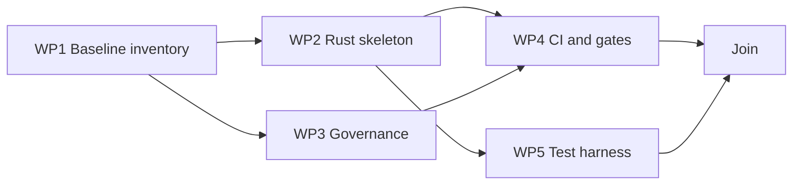

# Plan 01: Repository foundation and governance

## Status

`READY`

## Goal

把当前以 Markdown、manifest、脚本为主的仓库初始化为可持续开发的 Rust 2024 工程，建立唯一质量门禁、模块骨架、根 `AGENTS.md`、基础 CI 和测试框架，为后续执行图内核提供稳定落点。

## User-visible outcome

- 仓库可在 Windows、Linux、macOS 上执行 `cargo build/test`；
- `cargo fmt`、Clippy 和测试命令固定；
- Rust package、模块边界和 composition root 骨架存在；
- `AGENTS.md` 明确架构/Plan/执行图/报告的事实源和无历史包袱规则；
- 后续 Plan 不再自行发明工程目录和验证命令。

## Governing architecture references

- `docs/design/architecture-and-detailed-design.md#4-总体架构和依赖方向`
- `docs/design/architecture-and-detailed-design.md#6-代码组织`
- `docs/design/architecture-and-detailed-design.md#15-测试策略与工程质量门禁`
- `docs/design/architecture-and-detailed-design.md#19-历史包袱清理`

## Requirements traceability

| Requirement | Architecture section | Work package | Acceptance evidence |
|---|---|---|---|
| Rust stable / Edition 2024 / single package | §5, §6 | WP1, WP2 | Cargo metadata/build |
| Windows first-class, Linux/macOS CI | §15, §16 | WP4 | CI matrix config and local tests |
| CLI/MCP shared domain/application | §4, §6 | WP2 | module dependency tests/review |
| business code no unsafe | §14, §15 | WP3 | source scan + Clippy |
| durable AGENTS governance | §1, §12, §15 | WP3 | AGENTS.md inspection |
| remove duplicate config sources | §15 | WP1 | config inventory |

## Current evidence and baseline

| Area | Current implementation | Evidence | Verified behavior | Gap |
|---|---|---|---|---|
| Rust | absent | no `Cargo.toml` | no binary | complete foundation missing |
| Skills | four source Skills | `skills/*/SKILL.md` | current placeholders reference future CLI/MCP | retain as read-only in this Plan |
| Plugin manifests | drafts exist | `.claude-plugin/`, `.agents/`, `plugins/mine/` | not validated against built binary | later Plans |
| Scripts | PowerShell/Shell/Python | `scripts/` | install/verify draft behavior | Rust parity later |
| Governance | requirements only | `REQUIREMENTS.md` | product boundaries explicit | no root AGENTS |
| CI | absent | no workflow | none | create baseline |

## Research source register

| Source title | Organization/version | URL | Accessed | Verified claim | Plan implication |
|---|---|---|---|---|---|
| Rust 2024 Edition Guide | Rust 1.85+ | https://doc.rust-lang.org/stable/edition-guide/rust-2024/ | 2026-07-23 | Edition 2024 is stable | set `edition = "2024"` |
| Cargo Book — Manifest | Rust stable | https://doc.rust-lang.org/cargo/reference/manifest.html | 2026-07-23 | package metadata/lints live in manifest | one root Cargo manifest |
| Clippy usage | Rust stable | https://doc.rust-lang.org/clippy/usage.html | 2026-07-23 | `cargo clippy -- -D warnings` can gate diagnostics | CI gate |
| rustfmt | Rust stable | https://github.com/rust-lang/rustfmt | 2026-07-23 | rustfmt is standard formatter | fixed format gate |
| GitHub Actions Rust | GitHub official | https://docs.github.com/en/actions/automating-builds-and-tests/building-and-testing-rust | 2026-07-23 | matrix CI can build/test Rust | cross-platform workflow |

Executors must open these pages and verify current syntax before editing.

## Decisions

### Material user decisions

- 仓库仍名 `mine-is-not-everyones`；
- 核心 Skill 数量固定为四个；
- Rust 代码直接位于同一仓库；
- 仅适配四个平台。

### Local decisions

- v1 使用一个 package，不建 workspace；
- 根 `Cargo.toml` 是 Rust lint/dependency 事实源；
- `rust-toolchain.toml` 只固定 channel/profile/components；
- 暂不引入 nightly；
- 不在本 Plan 提前实现业务代码。

### Assumptions and unresolved gates

- 实施时选择当前 stable toolchain，不能硬编码本文日期下的具体 patch，除非 release 策略要求；
- `cargo-deny` 是否作为硬门禁由 WP4 根据维护成本决定并记录。

## Scope

### In scope

- Rust package 和 toolchain；
- 模块骨架；
- error/output 基础类型骨架；
- 基础测试目录；
- AGENTS.md；
- CI baseline；
- `.gitignore`/`.mine/.gitignore` 初始规则；
- README 的开发者构建段落。

### Non-goals

- 执行图类型和状态机；
- CLI 命令；
- MCP；
- Skill 文本回写；
- plugin manifest 修复；
- agent installer。

### Historical baggage to remove

- 不删除旧脚本，但标注为 legacy bootstrap/helpers；
- 不建立第二套 Python 工程配置；
- 不保留无用多 crate 预留。

## Dependency and parallelism graph



| Work package | Depends on | Parallel group | Exclusive write scope | Shared-file requests | Start gate | Join gate |
|---|---|---|---|---|---|---|
| WP1 | — | A | repository inventory only | none | clean baseline inspected | inventory recorded |
| WP2 | WP1 | B1 | `Cargo.toml`, `Cargo.lock`, `rust-toolchain.toml`, `src/` | none | versions researched | build passes |
| WP3 | WP1 | B2 | `AGENTS.md`, `.mine/.gitignore`, root `.gitignore` if required | README note | inventory complete | governance reviewed |
| WP4 | WP2, WP3 | C1 | `.github/workflows/ci.yml`, optional `deny.toml` | Cargo feature matrix from WP2 | build passes locally | workflow syntax reviewed |
| WP5 | WP2 | C2 | `tests/`, test support modules | no Cargo dependency change without WP2 owner | skeleton builds | sample test passes |

WP2 and WP3 may run in parallel. WP4 and WP5 may run in parallel after their gates.

## Work packages

### WP1 — Baseline and configuration inventory

- Inspect every root file, script, Skill reference and manifest.
- Record which files are source and which are generated drafts.
- Confirm no hidden Rust project exists.
- Identify duplicate version fields across package/plugin manifests but do not normalize them yet.
- Verify current Python scripts can still run before later replacement.
- Output a short baseline section in the implementation report.

Verification:

```bash
git status --short
find . -maxdepth 4 -type f
python scripts/verify.py
```

Expected evidence: exact existing file list and Python verification result.

### WP2 — Rust package and module skeleton

Create:

```text
Cargo.toml
Cargo.lock
rust-toolchain.toml
src/main.rs
src/cli/mod.rs
src/output/mod.rs
src/domain/mod.rs
src/application/mod.rs
src/infrastructure/mod.rs
src/render/mod.rs
src/mcp/mod.rs
src/agent/mod.rs
src/dist/mod.rs
src/diagnostics/mod.rs
```

Requirements:

- `edition = "2024"`；
- package name and binary name are `mine`；
- repository/license/version metadata aligned；
- only foundation dependencies are added; no speculative platform SDK；
- module visibility defaults private；
- main returns stable exit handling skeleton；
- no placeholder panic/todo in production path；
- no `unsafe`。

### WP3 — AGENTS.md and repository governance

Create root `AGENTS.md` containing:

- architecture source path；
- Plan/report/graph paths；
- TOML fact source vs generated Markdown；
- Plan immutability；
- no historical baggage；
- official research requirement；
- exact Rust quality gates；
- scope/commit discipline；
- Skills must use MCP/JSON and never hand-edit graph；
- reports cannot claim timeout/skip as pass。

Use `skills/mine-arch/references/AGENTS.template.md` as evidence, but adapt Python-specific language to Rust.

### WP4 — CI and quality gates

Create Linux/Windows/macOS CI with:

```bash
cargo fmt --all -- --check
cargo clippy --workspace --all-targets --all-features -- -D warnings
cargo test --workspace --all-features
```

Also run `python scripts/verify.py` until Rust `dist verify` replaces it.

Rules:

- no duplicate workflow commands with divergent flags；
- cache is optional and must not affect correctness；
- Windows paths with spaces included in at least one test later；
- no release publishing in this Plan。

### WP5 — Test harness

Create:

- integration test helper to invoke binary；
- temporary repository fixture helper；
- smoke test for `mine --help`/`--version`；
- source scan test or CI check rejecting `unsafe` in project code, excluding generated/dependency code。

## Integration and join procedure

1. WP2 owner integrates Cargo and module skeleton.
2. WP3 owner commits governance separately if cleanly reviewable.
3. WP4 consumes exact commands from AGENTS.
4. WP5 runs after Cargo lock settles.
5. Run full gates and inspect staged files.
6. No changes to `skills/` or plugin generated assets.

## Verification matrix

| Scope | Command | Preconditions | Expected evidence | Owner |
|---|---|---|---|---|
| format | `cargo fmt --all -- --check` | Rust files exist | exit 0 | WP2 |
| lint | `cargo clippy --workspace --all-targets --all-features -- -D warnings` | deps locked | exit 0 | WP4 |
| tests | `cargo test --workspace --all-features` | harness exists | exit 0 | WP5 |
| build | `cargo build --release` | Cargo valid | binary produced | WP2 |
| legacy Skill verify | `python scripts/verify.py` | Python available | accurate output | WP4 |
| unsafe scan | project test/script | source exists | no project unsafe | WP5 |

## Acceptance checklist

- [ ] Rust package builds on Windows/Linux/macOS CI configuration.
- [ ] Edition/toolchain are explicit.
- [ ] AGENTS.md contains durable MINE governance.
- [ ] One exact set of quality gates is documented and executable.
- [ ] No execution-graph business logic was prematurely implemented.
- [ ] Existing Skills and manifests were preserved.
- [ ] No unrelated user files were changed.

## Report path

`docs/plan/reports/01-repository-foundation-and-governance-implementation.md`

## Suggested commits

1. `build: initialize Rust package and module boundaries`
2. `docs: establish MINE repository governance`
3. `ci: add cross-platform Rust quality gates`
