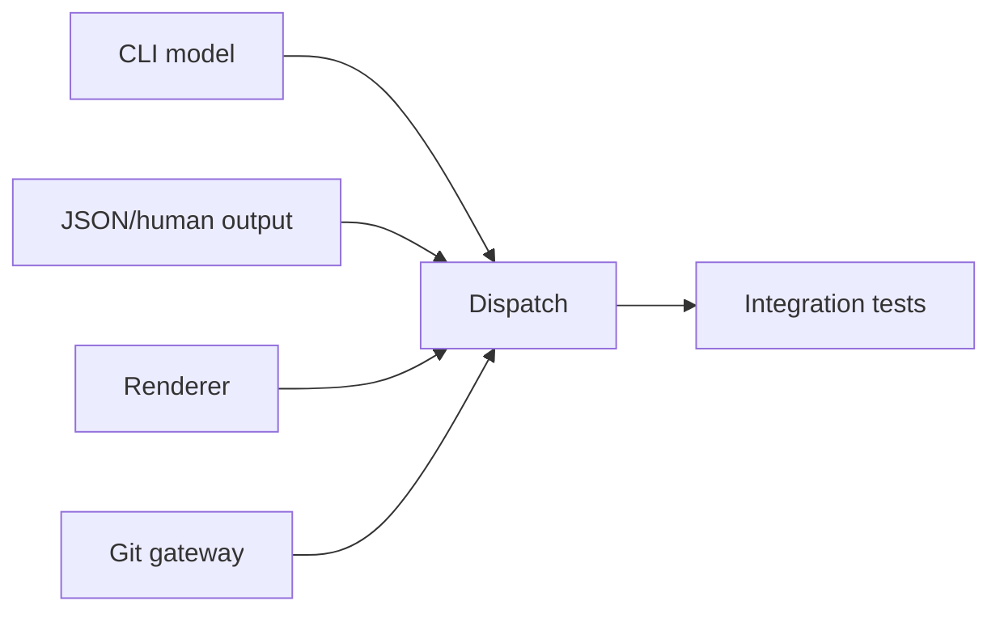

# Plan 03: CLI, JSON contract, rendering and Git evidence

## Status

`BLOCKED`

## Goal

基于 Plan 02 的 application services 实现完整核心 CLI、稳定 JSON envelope、人类输出、Markdown renderer、Git 只读证据校验和 `mine init/doctor` 的仓库级部分。

## User-visible outcome

用户和 Skill 可通过真实命令完成执行图全生命周期；JSON 输出可稳定解析；Markdown 由 TOML 确定生成；Git evidence 可选严格校验。

## Governing architecture references

- 架构 §10 CLI 公开契约
- 架构 §7.3 TOML / §9 recovery
- 架构 §14 日志与安全
- 架构 §15 测试门禁

## Requirements traceability

| Requirement | Architecture section | Work package | Acceptance evidence |
|---|---|---|---|
| stable core commands | §10.1 | WP1, WP4 | help snapshots and lifecycle tests |
| stable JSON envelope/error codes | §10.3, §10.4 | WP2 | JSON schema snapshots |
| generated Markdown | §7.3, §10 | WP3 | golden output and revision match |
| read-only Git evidence | §10, §14.3 | WP5 | fake/real Git integration tests |
| repository discovery/init | §7.3, §9, §10 | WP4 | temp-repo tests |

## Current evidence and baseline

- Plan 02 provides services and ports but no user-facing adapter.
- Existing Skills contain provisional command names that are not authoritative until this Plan passes.
- Existing `execution-graph.md` is bootstrap-generated and must become renderer-owned.
- Existing scripts do not provide the required stable JSON envelope.

## Decisions

- CLI is the first stable public contract and therefore receives contract snapshots.
- Human output may evolve within a major version; JSON `schema_version = 1` is compatibility-sensitive.
- Markdown render order follows deterministic graph order, not file insertion order.
- Git strictness remains opt-in per command/config; missing Git is not silently ignored when strict mode is requested.

## Research source register

| Source | URL | Accessed | Claim | Implication |
|---|---|---|---|---|
| clap docs | https://docs.rs/clap/ | 2026-07-23 | derive subcommands/global args | typed CLI tree |
| assert_cmd | https://docs.rs/assert_cmd/ | 2026-07-23 | process CLI testing | black-box JSON/human tests |
| Git rev-parse | https://git-scm.com/docs/git-rev-parse | 2026-07-23 | repo/commit resolution | read-only gateway |
| Git merge-base | https://git-scm.com/docs/git-merge-base | 2026-07-23 | ancestor verification | strict commit evidence |

## Scope

### In scope

- all core graph/plan commands；
- human/JSON output；
- exit codes；
- Markdown renderer；
- `mine init`；
- repository-level doctor；
- Git read-only gateway；
- CLI integration/golden tests。

### Non-goals

- MCP；
- Skill modification；
- dist/plugin；
- platform installer。

## Parallelism



WP1, WP2, WP3, WP5 may proceed in parallel with one shared Cargo owner.

## Work packages

### WP1 — clap command model

Implement exact architecture commands and arguments. Requirements:

- global args accepted before/after subcommand where clap allows；
- repeatable predecessor/path/commit options；
- no ambiguous positional plan add；
- `--format json` suppresses color/progress；
- `--dry-run` available only/also globally but passed only to writes；
- help examples reflect Windows-safe quoting。

### WP2 — Stable output and errors

Implement human presenter and JSON envelope.

- single JSON object；
- stdout only payload；
- stable error code mapping；
- details typed enough for Skill branch；
- partial success exit 6；
- no stack traces unless explicit debug environment to stderr；
- snapshot tests。

### WP3 — Deterministic Markdown renderer

Generate:

- warning header；
- source/revision/time；
- summary counts；
- table ordered by topo/ID stable rule；
- dependency diagram/text；
- READY frontier；
- waves；
- terminal evidence links。

Renderer never parses existing Markdown.

### WP4 — Dispatch and complete lifecycle

Wire commands to services. Implement:

- init；
- graph validate/render/status/show/ready/wave；
- plan add/show/start/implemented/accept/reject；
- expected revision；
- dry-run diff/result；
- precise exit codes。

### WP5 — Git evidence gateway

Only parameter-array invocations:

```text
git rev-parse --show-toplevel
git rev-parse --verify <commit>^{commit}
git merge-base --is-ancestor <commit> HEAD
git ls-files --error-unmatch <path>
git status --porcelain -- <path>
```

No shell. Distinguish Git missing, non-repo, invalid commit, not ancestor, untracked evidence.

### WP6 — CLI end-to-end tests

Create temp repo scenarios:

- init twice；
- add READY/BLOCKED；
- dependency acceptance releases downstream；
- reject keeps blocked；
- revision conflict；
- JSON parse；
- human output；
- render determinism；
- strict Git；
- path with spaces；
- stdout/stderr separation。

## Verification matrix

```bash
cargo fmt --all -- --check
cargo clippy --workspace --all-targets --all-features -- -D warnings
cargo test --workspace --all-features
cargo run -- --help
cargo run -- --format json init --repo <temp>
```

Exact option order must follow implementation help; update docs if architecture syntax needs non-material adjustment.

## Acceptance checklist

- [ ] Every required core command exists.
- [ ] JSON schema is stable and tested.
- [ ] Human output is not needed for automation.
- [ ] Markdown is deterministic and marked generated.
- [ ] Git operations are read-only and shell-free.
- [ ] Full lifecycle works in temp Git repo.
- [ ] Windows path tests pass.
- [ ] Plan 04 and Plan 05 can begin independently.

## Report path

`docs/plan/reports/03-cli-json-rendering-and-git-evidence-implementation.md`

## Suggested commits

1. `feat: expose execution graph through stable CLI contracts`
2. `feat: render deterministic execution graph views`
3. `feat: verify plan evidence through read-only Git`
4. `test: cover CLI lifecycle and JSON contracts`
