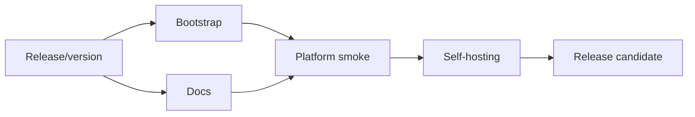

# Plan 08: Release, bootstrap and end-to-end self-hosting

## Status

`BLOCKED`

## Goal

完成多平台 release、checksums、最小 bootstrap、最终 README/用户手册和真实四端端到端验收；证明 MINE 可以用自身 Skills 和执行图管理 MINE 的开发流程。

## User-visible outcome

用户可从 GitHub 一行安装，随后：

```bash
mine agent install --agent all
mine doctor --agents all
```

并在四个平台完成 MINE workflow。仓库发布 tag 后二进制、Skills、plugins 和文档版本一致。

## Governing architecture references

- 架构 §16 构建发行
- 架构 §20 最终闭环
- `docs/user-guide.md`
- 根 REQUIREMENTS 最终验收

## Requirements traceability

| Requirement | Architecture section | Work package | Acceptance evidence |
|---|---|---|---|
| single-file releases/checksums | §16 | WP1 | release artifacts |
| minimal bootstrap | §16.3 | WP2 | clean-machine test |
| tested four-agent manual | §13, §20 | WP3, WP4 | exact version evidence |
| self-hosting | §20 | WP5 | complete graph lifecycle |
| legacy cleanup | §19 | WP6 | source inventory |
| version consistency | §16.2 | WP1 | release preflight |

## Current evidence and baseline

- Plan 07 provides install/doctor but no public binary distribution.
- Existing bootstrap scripts target repository/script installation and must be reduced.
- Current user guide contains target commands, some of which remain provisional until real platform smoke.
- All prior Plans must be ACCEPTED before release candidate work.

## Decisions

- A release is blocked if docs claim an untested native installation route.
- Checksums are mandatory; code signing/notarization is optional and cannot be claimed without credentials.
- First release may omit a target only if README and release matrix say so explicitly.

## Research source register

| Source | URL | Accessed | Plan implication |
|---|---|---|---|
| GitHub Actions releases | https://docs.github.com/en/repositories/releasing-projects-on-github/automatically-generated-release-notes | 2026-07-23 | release workflow/artifacts |
| Rust target support | https://doc.rust-lang.org/rustc/platform-support.html | 2026-07-23 | target matrix |
| GitHub artifact attestations/checksums | current official GitHub docs | implementation date | integrity strategy |
| Claude/Codex/Pi/OpenCode official install docs | sources in architecture | implementation date | final real commands |

## Scope

- release workflow；
- target binaries；
- SHA256SUMS；
- bootstrap.ps1/sh；
- version consistency；
- final README/user guide；
- local/native marketplace instructions；
- E2E test repository；
- MINE self-hosting acceptance；
- migration/removal of superseded scripts。

Non-goals:

- auto update unless explicitly selected；
- code signing/notarization unless credentials available；
- new features；
- worktree scheduler。

## Dependency graph



## Work packages

### WP1 — Version and release pipeline

- one version policy；
- Cargo/package/plugin consistency check；
- dist sync/verify before build；
- matrix targets；
- checksums；
- release artifacts；
- release notes；
- smoke binary。

Decide and document whether Linux aarch64 is tier-1 in v1.

### WP2 — Minimal bootstrap

PowerShell and shell:

- detect platform；
- select pinned/latest release safely；
- download binary/checksum；
- verify；
- install PATH；
- run `mine --version`；
- optionally prompt/instruct `mine agent install`。

No duplicated config/Skill logic.

### WP3 — Final documentation

Update root README and `docs/user-guide.md` with only tested commands:

- Claude standalone/native；
- Codex native/fallback；
- Pi package；
- OpenCode；
- workflow；
- troubleshooting；
- update/uninstall；
- security warning；
- MINE philosophy/non-supported platforms。

Remove aspirational commands that were not implemented.

### WP4 — Real platform smoke tests

On available environments:

- Claude plugin validate/install/MCP tools；
- Codex plugin validator/install/discovery；
- Pi Git package/call Skill；
- OpenCode Skill/MCP；
- standalone all；
- duplicate detection。

Record exact versions and limitations.

### WP5 — Self-hosting end-to-end

Use a clean fixture or MINE repo branch:

1. `mine init`；
2. register sample DAG；
3. graph wave；
4. start/implemented；
5. accept/reject；
6. MCP equivalent；
7. Skill contract workflow；
8. doctor；
9. dist verify；
10. Release install on clean user profile/container/VM.

Confirm current repository execution graph and all accepted reports are internally consistent.

### WP6 — Legacy cleanup and release readiness

- remove superseded complex install scripts or reduce to bootstrap；
- remove stale manifests；
- no untracked generated plugin drift；
- no TODO placeholders；
- security/readme review；
- create v1 release checklist。

## Verification matrix

```bash
cargo fmt --all -- --check
cargo clippy --workspace --all-targets --all-features -- -D warnings
cargo test --workspace --all-features
cargo build --release
mine dist verify
mine doctor --agents all
```

Plus platform-specific native validation and clean install tests.

## Acceptance checklist

- [ ] Release artifacts for promised targets.
- [ ] Checksums verified.
- [ ] Bootstrap minimal and safe.
- [ ] Four platform manuals tested.
- [ ] Standalone install works without repo checkout.
- [ ] Native plugin/package paths validated.
- [ ] Self-hosting lifecycle complete.
- [ ] All prior Plans accepted.
- [ ] No duplicate legacy business logic.
- [ ] README states unsupported platforms clearly.
- [ ] `mine` manages MINE itself.

## Report path

`docs/plan/reports/08-release-bootstrap-and-end-to-end-self-hosting-implementation.md`

## Suggested commits

1. `ci: publish cross-platform MINE release artifacts`
2. `feat: bootstrap verified MINE binaries`
3. `docs: finalize four-agent installation and workflow guide`
4. `test: prove MINE end-to-end self-hosting`
5. `chore: prepare v1 release`
