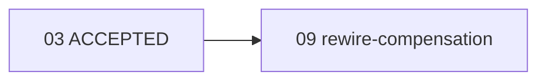

# Plan 09: Execution-graph compensation rewiring (CLI-managed)

## Status
`DRAFT` (to be released to `READY` by `mine plan add` on registration; hard predecessor `03` is `ACCEPTED`).

## Goal

Add a first-class, deterministic, CLI-managed operation that reroutes a
rejected plan's downstream dependencies onto its **registered compensating
plan**, through the accepted application/persistence path. This closes the
execution-graph lifecycle gap exposed when Plan 05 was rejected and its
compensating Plan 05-1 was registered: the accepted CLI had no supported
operation to replace a rejected predecessor with its compensating plan, so
downstream Plan 06 still names `05` even though it should now depend on
`05-1`. The bootstrap-era manual reroute (Plan `02` -> `02-1`) cannot be
reproduced because the bootstrap exception has ended and manual editing of
`docs/plan/execution-graph.{toml,md}` is prohibited.

## User-visible outcome

After this plan is accepted and merged into `dev`, an authorized reviewer can
run, exactly once:

```
mine plan rewire-compensation --id 05 --format json
```

which atomically rewrites downstream successors' hard/soft predecessor entries
from `05` to `05-1` (derived from `05`'s `compensating_plan`), bumps the graph
revision, regenerates the Markdown view, and reports the affected successors.
Only after that rewiring is merged does Plan 05-1 implementation resume.

Until this command exists and is accepted, no agent may hand-edit the graph to
repair the `05` -> `05-1` dependency.

## Governing design references

- `docs/design/execution-graph/state-machine-and-algorithms.md#compensation-rewiring` (the algorithm, preconditions, idempotency, result — authoritative)
- `docs/design/execution-graph/state-machine-and-algorithms.md#allowed-transitions` (REJECTED is terminal; no REJECTED -> BLOCKED)
- `docs/design/execution-graph/domain-model.md` (the `compensating_plan` field as single source of truth for rewiring)
- `docs/design/execution-graph/persistence-and-concurrency.md#revision-and-locking` (the lock -> reload -> recheck -> atomic write -> render transaction this operation reuses)
- `docs/design/interfaces/cli-contract.md#compensation-rewiring` (CLI command group, result envelope, error codes)
- `docs/design/governance/branch-and-plan-lifecycle.md#compensation-and-downstream-rewiring` (governance policy: register compensating plan, then rewire; rejected is terminal; accepted/active successors never rewritten)
- `docs/design/system/component-architecture.md` (domain = pure rules; CLI adapter wires domain into the persistence transaction; no second implementation)

## Requirements traceability

| Requirement | Design leaf/anchor | Work package | Acceptance evidence |
|---|---|---|---|
| 1. Rejected plan superseded only by explicitly registered compensating plan | domain-model.md `compensating_plan`; state-machine #compensation-rewiring inputs | WP1 | Domain fn rejects any rewire whose replacement is not the rejected plan's `compensating_plan` |
| 2. Lock -> reload -> revision -> semantic -> mutate -> atomic persist -> render | persistence-and-concurrency #revision-and-locking | WP3 | Handler routes through `TomlStore::save_with_revision`; tests assert revision bump + MD regen atomically |
| 3. Never silently rewrite on similar id | state-machine #compensation-rewiring inputs | WP1, WP3 | Exact-id equality only; fuzz test with sibling id `05` vs `050` is not rewired |
| 4a. Original is REJECTED | state-machine #compensation-rewiring preconditions | WP1 | Non-REJECTED original -> `MINE_INVALID_TRANSITION` test |
| 4b. `compensating_plan` matches replacement | #compensation-rewiring inputs | WP1 | Replacement is derived, never caller-supplied; empty `compensating_plan` -> `MINE_GRAPH_INVALID` test |
| 4c. Replacement exists | #compensation-rewiring preconditions | WP1 | Missing replacement -> `MINE_PLAN_NOT_FOUND` test |
| 4d. Affected successors not IN_PROGRESS/IMPLEMENTED/ACCEPTED/REJECTED | #compensation-rewiring preconditions | WP1 | Locked-successor test -> `MINE_REWIRE_SUCCESSOR_LOCKED`, nothing written |
| 4e. No cycle introduced | #compensation-rewiring preconditions (reuses `topological_sort`) | WP1 | Cycle test -> `MINE_GRAPH_CYCLE`, nothing written |
| 4f. Unrelated predecessors/successors unchanged | #compensation-rewiring mutation | WP1 | Diff test: only the exact rejected-id occurrences change, order preserved |
| 5. Graph mutation + Markdown rendering atomic to caller | persistence-and-concurrency #revision-and-locking | WP3 | Idempotent-no-op writes nothing; failed validation leaves bytes unchanged (md5) |
| 6. Deterministic JSON result | cli-contract #compensation-rewiring result envelope | WP3 | Golden JSON envelope test |
| 7. Idempotency decision documented | state-machine #compensation-rewiring idempotency | Design (done), WP3 | Re-run test: `revision_before == revision_after`, `affected_successors: []` |
| 8. No arbitrary graph-editing API | cli-contract (only `rewire-compensation` added) | WP3 | No generic `set_predecessors`/`edit_graph` symbol introduced (grep gate) |
| 9. Do not weaken immutability of accepted/active plans | state-machine #compensation-rewiring preconditions | WP1 | Accepted/IN_PROGRESS/IMPLEMENTED/REJECTED successors never mutated (test) |

## Current evidence and baseline

| Area | Current implementation | Evidence path/commit | Verified behavior | Gap |
|---|---|---|---|---|
| Plan reject sets compensating plan | `src/cli/commands.rs::plan_reject` | dev `2dc1009` | Sets `node.compensating_plan`; comment: "Downstream rerouting is the reviewer's responsibility; we leave successor predecessor edges to a `plan add` of the compensation node (kept bounded)." | No operation performs the reroute |
| State machine | `docs/design/execution-graph/state-machine-and-algorithms.md` | pre-this-plan | Had misleading `REJECTED -> BLOCKED` row no operation implements; bootstrap Plan 02 stayed REJECTED | Corrected by this plan's design commit `8fe9ab4` |
| Persistence transaction | `src/infrastructure/toml_store.rs::save_with_revision` | dev `2dc1009` | lock -> reload -> revision check -> mutate -> atomic write -> render; bumps revision once | Reusable as-is; no change needed |
| Cycle detection | `src/domain/validation.rs::topological_sort` | dev `2dc1009` | Returns `MineError::GraphCycle` with cycle path on cycle | Reusable for post-rewire cycle check |
| Ancestor lookup | `src/domain/graph.rs::PlanWorkspace::is_hard_ancestor`, `get`, `get_mut` | dev `2dc1009` | Pure graph traversal helpers | Reusable |
| Error model | `src/domain/error.rs::MineError` + `code()` | dev `2dc1009` | Stable `MINE_*` codes | Add `RewireSuccessorLocked` variant + code |
| Exit-code map | `src/output/mod.rs::exit_code_for` | dev `2dc1009` | Maps domain errors to exit codes | Add mapping for new variant |
| CLI dispatch | `src/cli/mod.rs::command_name`, `commands::handle` | dev `2dc1009` | `mine plan add|show|start|implemented|accept|reject` dispatched | Add `("plan","rewire-compensation")` arm + handler |
| Authoritative graph | `docs/plan/execution-graph.toml` rev 17 | dev `2dc1009` | Plan 05 REJECTED (`compensating_plan="05-1"`); Plan 06 BLOCKED `hard=[04,05]`; Plan 05-1 DRAFT `hard=[03]` | 06 must be rewired to `[04,05-1]` after this plan is accepted (reviewer step, not this plan) |

## Research source register

No new external technology is introduced. This plan reuses the accepted
in-repository execution-graph engine and the existing CLI/envelope contracts.
The only design sources are repository design documents (cited above) and the
accepted implementation on `dev` (`2dc1009`). No web research is required
because the capability is an internal graph-lifecycle operation with no
external protocol, library, or standard dependency. (Per `mine-plan-create`
Phase 4, external research applies to material external technologies; none
apply here.)

## Decisions

### Material user decisions

- **Idempotency model**: idempotent success on re-run with no affected
  successors (writes nothing, bumps no revision, returns
  `revision_before == revision_after`, `affected_successors: []`), versus a
  precise stable error. The user delegated this to Design; the design commits
  it as idempotent success for automation safety (callers retry without error
  branches), documented in `state-machine-and-algorithms.md#compensation-rewiring`.
- **Hard predecessor and lineage**: the plan is rooted in the Plan 03
  lifecycle/CLI lineage, hard predecessor `["03"]`, as the user requested. It
  does NOT depend on `04`, `05`, `05-1`, or `06` and can be implemented and
  accepted independently of the MCP track, so the rewiring capability exists
  before any live reroute is attempted.
- **Live reroute is the reviewer's post-acceptance step, not this plan's
  implementation**: this plan implements and tests the capability on ISOLATED
  TEMPORARY repositories only. The live `06` -> `05-1` reroute happens only
  after this plan is independently accepted and merged into `dev`.

### Local decisions made by the planner

- **Command placement**: `mine plan rewire-compensation` under the `plan`
  group (not `mine graph`), because it is the deterministic closure of
  `mine plan reject` (which set `compensating_plan`) and is anchored on a
  single rejected plan id, even though it mutates multiple successors' edges.
  A bare `mine graph rewire` would suggest arbitrary graph editing, which
  requirement 8 forbids.
- **Rewire both hard and soft predecessors**: every exact occurrence of the
  rejected id in either `hard_predecessors` or `soft_predecessors` of mutable
  successors is replaced, because leaving any predecessor pointing at a
  terminal-rejected plan is a stale edge. Soft deps do not block readiness,
  but consistency demands their rerouting; this is simpler and more complete
  than rewiring only hard deps and emitting warnings.
- **Replacement status gate**: the replacement must exist and not be
  `REJECTED` (no circular compensation). The requirement does not mandate the
  replacement be `READY`/`ACCEPTED`; a `DRAFT`/`BLOCKED` replacement simply
  leaves the successor blocked until the replacement is accepted, which is
  correct. (In the live scenario, `05-1` is `READY`.)
- **Predecessor order preservation**: replacement is in-place; order, count
  (minus the rejected id, plus the compensating id where it replaces), and
  unrelated entries are identical. If a successor listed the rejected id
  twice (should not happen due to structural validation, but defensively),
  each exact occurrence is replaced once.
- **Affected-successors communication**: the pure domain function returns
  `(PlanWorkspace, Vec<String>)` (new workspace + affected successor ids in
  stable insertion order). The CLI handler threads the affected list out of
  the `save_with_revision` closure via a captured `std::cell::RefCell<Option<Vec<String>>>`
  read after the transaction commits.
- **New error variant**: `MineError::RewireSuccessorLocked { plan_id, successor_id, successor_status }`
  with code `MINE_REWIRE_SUCCESSOR_LOCKED`, mapped to exit `3` (GATE), since a
  locked successor is a workspace/lifecycle gate failure on the same footing
  as `PredecessorNotAccepted`/`EvidenceMissing`.
- **Result data shape**: `{"rejected_plan", "compensating_plan", "affected_successors"}`
  with top-level `revision_before`/`revision_after` (equal on idempotent
  no-op). Command identifier `"plan.rewire-compensation"`.

### Assumptions and unresolved gates

- Assumes the accepted `mine` CLI on `dev` exposes the existing
  `save_with_revision`, `topological_sort`, and `MineError::GraphCycle` as
  verified above; this is repository evidence, not an assumption.
- Unresolved until acceptance: whether reviewers prefer `mine graph` placement
  (already decided as `mine plan` here; recorded for review).

## Scope

### In scope

- A pure domain operation `rewire_compensation(ws, rejected_id) -> (PlanWorkspace, Vec<String>)`
  and its validation (preconditions 1-5 above), in a new `src/domain/rewire.rs`.
- One new `MineError` variant + code + exit-code mapping.
- One new CLI command handler `plan_rewire_compensation` and its dispatch arm.
- The deterministic JSON result envelope (command id, revisions, data).
- Integration and domain tests on ISOLATED TEMPORARY repositories.
- A live-graph-byte-unchanged invariant test (the suite never touches the live
  repo).

### Non-goals

- Do NOT create or expose any generic graph-editing API (no `set_predecessors`,
  `edit_plan`, `move_plan`, etc.).
- Do NOT perform the live `06` -> `05-1` reroute in this plan's
  implementation. That is the reviewer's post-acceptance step.
- Do NOT implement, resume, or depend on Plan 05-1 (the MCP official-SDK
  compensation). This plan is independent of the MCP track.
- Do NOT change the MCP tool surface (no new MCP tool); the capability is
  CLI-only for now.
- Do NOT touch the rejected plan's status or fields (REJECTED is terminal).
- Do NOT manually edit `docs/plan/execution-graph.{toml,md}` at any point.

### Historical baggage to remove

- The misleading `REJECTED -> BLOCKED` state-machine row was already removed
  by the design commit `8fe9ab4` accompanying this plan. No further code
  baggage exists for this feature (it is net-new).

## Dependency and parallelism graph



| Work package | Depends on | Parallel group | Exclusive write scope | Shared-file requests | Start gate | Join gate |
|---|---|---|---|---|---|---|
| WP1 domain rewire | 03 accepted | A | `src/domain/rewire.rs` (new), `src/domain/mod.rs`, `src/domain/error.rs` | `src/domain/error.rs`, `src/domain/mod.rs` | 03 ACCEPTED | WP1 tests green |
| WP2 output/exit code | WP1 | A | `src/output/mod.rs` | `src/output/mod.rs` | WP1 done | exit-code test green |
| WP3 CLI handler + dispatch + result | WP1, WP2 | A | `src/cli/commands.rs`, `src/cli/mod.rs` | `src/cli/commands.rs`, `src/cli/mod.rs` | WP1+WP2 done | end-to-end test green |

Serialization note: WP1 -> WP2 -> WP3 are sequential (CLI depends on domain +
exit code). There is no parallel lane; the plan is a single narrow vertical
slice. Shared files (`src/cli/commands.rs`, `src/domain/error.rs`,
`src/output/mod.rs`) have this plan as their sole active owner because Plan
05-1 does not resume until this plan is accepted and the live reroute is
performed. If a future plan overlaps `src/cli/commands.rs` while 09 is
active, the parallel-execution protocol serializes that file (one owner).

## Work packages

### WP1 — Domain compensation-rewiring operation

- Purpose: pure domain validation + in-place predecessor substitution +
  affected-successor computation.
- Inputs and predecessors: `src/domain/graph.rs` (`PlanWorkspace`, `PlanNode`,
  `get`, `get_mut`, stable insertion order), `src/domain/validation.rs::topological_sort`
  (cycle check), `src/domain/status.rs::PlanStatus`, `src/domain/error.rs::MineError`.
- Exact files/symbols/contracts:
  - New `src/domain/rewire.rs`.
  - `pub fn rewire_compensation(ws: &mut PlanWorkspace, rejected_id: &str) -> MineResult<Vec<String>>`
    — validates preconditions on `ws`, then mutates `ws` in place (replaces
    exact rejected-id occurrences in `hard_predecessors` and
    `soft_predecessors` of each mutable successor, preserves order, refreshes
    `updated_at`), and returns the affected successor ids in stable insertion
    order. Does NOT bump revision (the caller's transaction does) and does NOT
    touch the rejected plan node.
  - Register `pub mod rewire;` in `src/domain/mod.rs`.
  - New `MineError::RewireSuccessorLocked { plan_id: String, successor_id: String, successor_status: String }`
    in `src/domain/error.rs`, with `code()` -> `"MINE_REWIRE_SUCCESSOR_LOCKED"`.
- Current behavior: no rewire operation exists.
- Required final behavior: see the algorithm in
  `state-machine-and-algorithms.md#compensation-rewiring` (preconditions 1-5,
  exact-id in-place replacement, cycle check via `topological_sort`, affected
  list in insertion order).
- Input/output/error/lifecycle semantics: pure, no I/O. Errors (all
  `MineResult::Err`): `PlanNotFound` (original or replacement missing),
  `InvalidTransition` (original not REJECTED), `GraphInvalid` (`compensating_plan`
  empty), `GraphInvalid` (replacement is REJECTED), `RewireSuccessorLocked`
  (any referencing successor is IN_PROGRESS/IMPLEMENTED/ACCEPTED/REJECTED),
  `GraphCycle` (post-rewire cycle). On any error `ws` is left unmutated
  (validation precedes mutation).
- Transactions, concurrency, retries, timeouts: none (pure). Concurrency is
  the CLI handler's concern (WP3) via `save_with_revision`.
- Security/privacy: none.
- Configuration/dependencies: none.
- Cleanup/removals: none.
- Edge and failure cases:
  - original not REJECTED; `compensating_plan` empty; replacement missing;
    replacement is REJECTED; successor locked (active/accepted/terminal);
    cycle through the compensating plan; successor lists the rejected id in
    both hard and soft (both replaced); successor does not reference the
    rejected id at all (unchanged, not in affected list); no successor
    references the rejected id (affected list empty — idempotent no-op path
    is the handler's, but the domain fn returns an empty Vec without error).
- Tests and fixtures (`tests/domain.rs` additions): seed a `PlanWorkspace`
    with a REJECTED plan `02` (`compensating_plan="02-1"`), an accepted
    `02-1`, and BLOCKED/DRAFT/READY successors depending on `02`; assert
    affected list == the referencing successors, predecessors now reference
    `02-1`, order preserved, unrelated edges intact. One test per error case
    above. One idempotent test: call twice, second returns `Vec::new()`, `ws`
    unchanged. One cycle test where `05-1` depends (transitively) on a
    successor -> `GraphCycle`.
- Narrow verification commands and expected evidence:
  - `cargo test --lib rewire` -> domain unit tests pass.
  - `cargo test --test domain rewire` -> integration domain tests pass.
  - `cargo clippy -p mine --lib -- -D warnings` -> no warnings in new module.
- Downstream artifact: `rewire_compensation` callable by WP3.
- Suggested commit: `feat(domain): compensation-rewiring operation and validation`.

### WP2 — Error code and exit-code mapping

- Purpose: expose `MINE_REWIRE_SUCCESSOR_LOCKED` and map it to exit `3`.
- Exact files/symbols: `src/domain/error.rs` (variant added in WP1), `src/output/mod.rs::exit_code_for`
  add arm `MineError::RewireSuccessorLocked { .. } => exit_code::GATE`.
- Tests: extend the `exit_code_for` unit tests in `src/output/mod.rs` to
  assert `RewireSuccessorLocked` maps to GATE (3); assert `code()` returns
  `MINE_REWIRE_SUCCESSOR_LOCKED`.
- Narrow verification: `cargo test --lib exit_code` green.
- Suggested commit: `feat(output): map MINE_REWIRE_SUCCESSOR_LOCKED to GATE`.

### WP3 — CLI handler, dispatch, deterministic result, integration tests

- Purpose: wire `rewire_compensation` into the shared
  `TomlStore::save_with_revision` transaction and emit the stable CLI result.
- Inputs and predecessors: WP1 domain fn, WP2 exit-code map, existing
  `src/cli/commands.rs::save_with_revision`, `build_context`, `envelope_for`,
  `flag`, `SystemClock`.
- Exact files/symbols/contracts:
  - `src/cli/commands.rs`: new `fn plan_rewire_compensation(parsed, rest) -> HandlerResult`.
    Requires `--id <rejected-id>`. Loads the current revision (read), then:
    - Computes `affected_successors` and performs the mutation inside
      `save_with_revision(&ctx, expected, |mut w| { ... })`. Because the
      closure returns only `PlanWorkspace`, the affected list is threaded out
      via a captured `std::cell::RefCell<Option<Vec<String>>>` set inside the
      closure and read after the transaction commits.
    - Idempotent no-op path: if, under the lock after reload, no successor
      references the rejected id, the handler MUST NOT call a write
      `save_with_revision`. Instead it leaves the graph untouched and
      returns the envelope with `revision_before == revision_after` (current
      revision) and `data.affected_successors == []`. (Implementation detail:
      the pure domain fn returning an empty affected list is the signal; the
      handler short-circuits the write when affected is empty. To avoid a
      read-modify-write race, the no-op detection MUST occur under the lock:
      use a read under the lock or run the domain fn inside the closure and
      skip the actual persistence write only when the store's save path
      supports a no-write fast path — see implementation note below.)
    - Builds the envelope: `command="plan.rewire-compensation"`,
      `with_revision(revision_before, revision_after)`,
      `with_data({"rejected_plan": id, "compensating_plan": comp, "affected_successors": [...]})`.
      where `comp` is read from the rejected plan's `compensating_plan` (load
      it under the lock too, or read from the post-mutation ws before it is
      replaced — capture it from the rejected node inside the closure).
  - `src/cli/mod.rs::command_name`: add `("plan", "rewire-compensation") => "plan.rewire-compensation"`.
  - `src/cli/mod.rs` dispatch (`commands::handle`): add the `"rewire-compensation" => plan_rewire_compensation(parsed, rest)` arm (the match in `commands::handle` — see dev `2dc1009` for the existing `"accept"/"reject"` arms).
- Implementation note on the atomic no-op: the cleanest design that keeps the
  no-op safe under concurrency is to ALWAYS run inside `save_with_revision`:
  the closure calls the domain fn; if affected is empty, the closure returns
  the workspace UNCHANGED (no predecessor edits, no `revision` bump) — BUT the
  store currently bumps revision on every successful closure. Therefore, to
  honor "no revision bump on idempotent no-op", the handler must detect the
  no-op WITHOUT persisting. Preferred approach: acquire the graph read lock
  (or reuse `save_with_revision` with a closure that signals no-write), load,
  run the domain fn on a clone; if affected is empty, release without writing
  and report current revision. If the existing `save_with_revision` cannot
  express a no-write path, add a tiny `TomlStore::with_locked<F>(&self, f: F)
  -> MineResult<R>` helper that only locks+loads (no write, no revision bump)
  and is used for the no-op path; this is a minimal, non-arbitrary addition
  strictly for read-under-lock, not a generic edit API. The implementing agent
  MUST choose whichever the accepted store API supports and record the exact
  approach in the implementation report. A generic graph editor is NOT
  permitted under any path.
- Current behavior: no `rewire-compensation` command.
- Required final behavior: see `cli-contract.md#compensation-rewiring`.
- Input/output/error/lifecycle semantics: `--format json` and human modes
  follow existing plan handlers. Exit codes: 0 success (including idempotent
  no-op), 2 usage (missing `--id`), 3 gate (locked successor), 4 validation
  (not REJECTED / empty compensating / replacement REJECTED), 5 conflict
  (revision/lock), per `cli-contract.md#exit-codes`.
- Transactions, concurrency, retries, timeouts: `save_with_revision` lock
  timeout from config; revision conflict on mismatch.
- Security/privacy: no shell, no Git, no file writes outside the graph and its
  generated Markdown.
- Configuration/dependencies: none.
- Cleanup/removals: none.
- Edge and failure cases: missing `--id` (usage); original not REJECTED;
  compensating_plan empty; replacement missing/REJECTED; locked successor;
  cycle; idempotent re-run; concurrent writers (revision conflict, no silent
  overwrite); `--no-color`/`--quiet` modes.
- Tests and fixtures (`tests/rewire.rs` NEW integration file + extend
  `tests/cli.rs` golden):
  - stdio/CLI: `mine plan rewire-compensation --id 05 --format json` against an
    ISOLATED temp repo seeded with `05 REJECTED (compensating_plan="05-1")`,
    `05-1 READY`, `06 BLOCKED hard=[04,05]`, `04 ACCEPTED` -> assert
    `ok:true`, `command:"plan.rewire-compensation"`, `revision_after ==
    revision_before + 1`, `data == {"rejected_plan":"05",
    "compensating_plan":"05-1","affected_successors":["06"]}`. Assert the
    temp repo's TOML now has `06 hard=[04,05-1]` and Markdown regenerated.
  - idempotent re-run on the same temp repo -> `revision_before ==
    revision_after`, `affected_successors == []`, TOML bytes unchanged.
  - not-REJECTED original -> `MINE_INVALID_TRANSITION`, exit 4, bytes
    unchanged (md5).
  - empty `compensating_plan` -> `MINE_GRAPH_INVALID`, exit 4, bytes unchanged.
  - missing replacement -> `MINE_PLAN_NOT_FOUND`, exit 4.
  - replacement is REJECTED -> `MINE_GRAPH_INVALID`, exit 4.
  - locked successor (`06 IN_PROGRESS`) -> `MINE_REWIRE_SUCCESSOR_LOCKED`,
    exit 3, bytes unchanged, `06` predecessors still `[04,05]`.
  - cycle (`05-1` hard-depends on `06`) -> `MINE_GRAPH_CYCLE`, exit 4,
    bytes unchanged.
  - sibling-id safety: a successor depending on `050` is NOT rewired when
    rewiring `05` (only exact `05` matches).
  - soft-predecessor reroute: a successor with only a soft dep on `05` is
    rewired to `05-1` in `soft_predecessors`.
  - unaffected predecessor order/count preservation assertion.
  - live-graph-byte-unchanged invariant: md5 of the real
    `docs/plan/execution-graph.toml` equal before and after the whole
    `tests/rewire.rs` suite (all tests use `tempfile`).
  - no arbitrary edit API: `grep -rnE "set_predecessors|edit_graph|move_plan"
    src/` returns nothing (gate).
- Narrow verification commands and expected evidence:
  - `cargo test --test rewire` -> all rewire integration tests pass.
  - `cargo test` -> full suite green.
  - `cargo run --quiet -- plan rewire-compensation --id 05 --format json`
    MUST NOT be run against the live repo during implementation (see Scope).
- Downstream artifact: the accepted `mine plan rewire-compensation` command,
  ready for the reviewer's post-acceptance live reroute of `06` -> `05-1`.
- Suggested commit: `feat(cli): mine plan rewire-compensation` and
  `test(rewire): compensation rewiring integration tests`.

## Integration and join procedure

1. WP1 produces the pure domain fn with green domain tests.
2. WP2 adds the error code/exit mapping; `cargo test --lib` green.
3. WP3 wires the CLI handler + dispatch + result envelope + integration
   tests; `cargo test` green; clippy clean; the no-op path verified not to
   bump revision.
4. Final join verification: `cargo fmt --all -- --check`,
   `cargo clippy --all-targets --all-features -- -D warnings -W unsafe-code`,
   `cargo test --all-targets --all-features`, `mine graph validate --format json`
   (`ok:true`), `mine design validate --format json` (`valid:true`), and the
   live-graph md5-unchanged invariant.

## Verification matrix

| Scope | Command | Preconditions | Expected evidence | Owner |
|---|---|---|---|---|
| Formatting | `cargo fmt --all -- --check` | clean checkout | no diff, exit 0 | WP3 |
| Lint + unsafe | `cargo clippy --all-targets --all-features -- -D warnings -W unsafe-code` | builds | no warnings, exit 0 | WP3 |
| Unit (domain+output) | `cargo test --lib` | WP1+WP2 | green | WP1/WP2 |
| Integration (rewire) | `cargo test --test rewire` | WP3 | all cases green | WP3 |
| Full suite | `cargo test --all-targets --all-features` | all WPs | 173+ existing + new green, 0 failed | WP3 |
| Graph health | `mine graph validate --format json` | clean repo | `ok:true`, plans unchanged | WP3 |
| Design health | `mine design validate --format json` | design commit applied | `valid:true`, `warnings:[]` | WP3 |
| No arbitrary edit API | `grep -rnE "set_predecessors|edit_graph|move_plan" src/` | WP3 | exit 1 (no matches) | WP3 |
| Live graph untouched | `md5sum docs/plan/execution-graph.toml` before/after `tests/rewire.rs` | WP3 | identical | WP3 |

## Acceptance checklist

- [ ] Every requirement (1-9) is traced to architecture, implementation, and evidence.
- [ ] Design changes (`8fe9ab4`) are merged into `dev` before this plan is accepted; cited anchors exist.
- [ ] The pure domain fn and CLI handler share one transaction; no second implementation.
- [ ] No generic graph-editing API introduced (grep gate).
- [ ] Idempotent re-run writes nothing, bumps no revision, returns empty affected list.
- [ ] Accepted/IN_PROGRESS/IMPLEMENTED/REJECTED successors are never mutated (immutability preserved).
- [ ] All tests run on ISOLATED temp repos; the live graph md5 is unchanged by the suite.
- [ ] Required quality gates pass (`fmt`, `clippy -D warnings -W unsafe-code`, `cargo test`, `mine graph validate`, `mine design validate`).
- [ ] The live `06` -> `05-1` rewiring is NOT performed by this plan's implementation (it is the reviewer's post-acceptance step).
- [ ] Plan 05-1 implementation is NOT begun by this plan.

## Post-acceptance reviewer handoff (NOT part of this plan's implementation)

After this plan is independently `ACCEPTED` and merged into `dev`, the
authorized reviewer performs, exactly once, against the live repository:

```
mine plan rewire-compensation --id 05 --format json
```

Expected result on the live repo at revision `17`:

```json
{
  "ok": true,
  "command": "plan.rewire-compensation",
  "revision_before": 17,
  "revision_after": 18,
  "data": {
    "rejected_plan": "05",
    "compensating_plan": "05-1",
    "affected_successors": ["06"]
  },
  "warnings": []
}
```

This rewrites Plan 06's `hard_predecessors` from `["04","05"]` to
`["04","05-1"]` and regenerates the Markdown view. The reviewer commits the
CLI-produced graph bookkeeping separately. Only after that reroute is merged
does Plan 05-1 implementation resume (05-1 becomes `READY` -> `IN_PROGRESS`
under normal `mine plan start`).

## Report path
`docs/plan/reports/09-execution-graph-compensation-rewiring-implementation.md`

## Suggested commits

- `feat(domain): compensation-rewiring operation and validation`
- `feat(output): map MINE_REWIRE_SUCCESSOR_LOCKED to GATE`
- `feat(cli): mine plan rewire-compensation`
- `test(rewire): compensation rewiring integration tests`
- (`docs(plan-09): implementation report` after implementation)

## Constraints honored by this plan (explicit)

- The implementation of this plan MUST NOT execute
  `mine plan rewire-compensation` against the live repository (or any
  successor currently named in the live graph). The capability is exercised
  only on ISOLATED TEMPORARY repositories in `tests/rewire.rs` and domain
  unit tests. Using the unaccepted operation against the live repo before
  acceptance would itself violate the governance rule this plan exists to
  enforce.
- After independent acceptance and merge into `dev`, the reviewer (not the
  implementation agent) uses the now-accepted `mine plan rewire-compensation
  --id 05` to rewire Plan 06 from `05` to `05-1`.
- Only then is Plan 05-1 implementation resumed.
- No manual editing of `docs/plan/execution-graph.{toml,md}` occurs at any
  point in this plan. Every graph transition (plan registration via
  `mine plan add`, eventual acceptance via `mine plan accept`) goes through
  the accepted CLI.