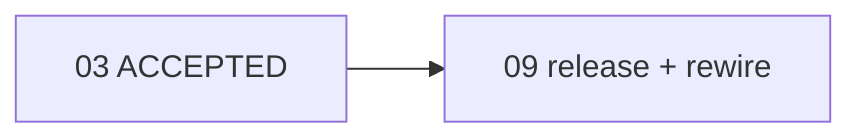

# Plan 09: Plan release and compensation rewiring (CLI-managed)

## Status
`DRAFT` — to become `READY` via the one-time break-glass exception recorded
in this plan (see [Break-glass exception](#break-glass-exception)), then
started via `mine plan start`. Hard predecessor `03` is `ACCEPTED`.

## Goal

Add two first-class, deterministic, CLI-managed operations that close
related execution-graph lifecycle gaps the accepted workflow cannot currently
perform:

1. **`mine plan release --id <id>`** — the explicit gate that moves a newly
   registered `DRAFT` plan into the startable frontier (`READY` when every
   hard predecessor is `ACCEPTED`, otherwise `BLOCKED`). `mine plan add`
   registers plans as `DRAFT`; `mine plan start` requires `READY`; automatic
   successor release happens only inside `mine plan accept`; so a standalone
   newly added `DRAFT` plan (no accepted upstream that triggers an accept
   pass) can never enter execution. This plan and the existing Plan 09 cannot
   even be started without this capability.
2. **`mine plan rewire-compensation --id <rejected-id>`** — reroutes a
   rejected plan's downstream dependencies onto its **registered compensating
   plan**, through the accepted application/persistence path. Closes the gap
   exposed when Plan 05 was rejected and 05-1 registered: the accepted CLI
   had no operation to replace a rejected predecessor with its compensating
   plan, so downstream Plan 06 still names `05`.

Both operations go through the shared application/persistence transaction
(`lock -> reload -> revision check -> semantic validation -> mutation ->
atomic persistence -> deterministic render`). Neither introduces an arbitrary
graph-editing API. Manual editing of `docs/plan/execution-graph.{toml,md}` is
prohibited (the bootstrap exception has ended), except for the single one-time
break-glass mutation recorded below that makes Plan 09 itself startable.

## User-visible outcome

After this plan is accepted and merged into `dev`, an authorized reviewer can
close the Plan 05 rejection and resume implementation of Plan 05-1:

```
mine plan rewire-compensation --id 05 --format json   # 06: hard preds 05 -> 05-1
mine plan release --id 05-1 --format json             # 05-1: DRAFT -> READY
mine plan start --id 05-1 --owner <owner> --run-id <run> --format json
```

The first rewrites downstream successors' exact predecessor entries from
`05` to `05-1` (derived from `05`'s `compensating_plan`), regenerates the
Markdown view, and bumps the graph revision. The second moves 05-1 to `READY`
(hard predecessor `03` is `ACCEPTED`). The third begins 05-1 implementation.
Each reads the authoritative current revision immediately before mutating.

Until these commands exist and are accepted, no agent may hand-edit the graph
to repair dependencies or release plans.

## Governing design references

- `docs/design/execution-graph/state-machine-and-algorithms.md#plan-release` (release algorithm, preconditions, idempotency, result — authoritative)
- `docs/design/execution-graph/state-machine-and-algorithms.md#compensation-rewiring` (rewiring algorithm, preconditions, idempotency, result — authoritative)
- `docs/design/execution-graph/state-machine-and-algorithms.md#allowed-transitions` (REJECTED is terminal; DRAFT/BLOCKED -> READY gates)
- `docs/design/execution-graph/domain-model.md` (the `compensating_plan` field as single source of truth for rewiring)
- `docs/design/execution-graph/persistence-and-concurrency.md#revision-and-locking` (the transaction both operations reuse)
- `docs/design/interfaces/cli-contract.md#plan-release` (CLI command + result envelope)
- `docs/design/interfaces/cli-contract.md#compensation-rewiring` (CLI command + result envelope)
- `docs/design/governance/branch-and-plan-lifecycle.md#registration-and-release` (registration vs release distinction)
- `docs/design/governance/branch-and-plan-lifecycle.md#compensation-and-downstream-rewiring` (governance policy)
- `docs/design/system/component-architecture.md` (domain = pure rules; CLI adapter wires domain into the persistence transaction; no second implementation)

## Requirements traceability

### Plan release

| Requirement | Design leaf/anchor | Work package | Acceptance evidence |
|---|---|---|---|
| R1. Accepts only a DRAFT plan | state-machine #plan-release preconditions | WP1, WP3 | Non-DRAFT plan -> `MINE_INVALID_TRANSITION`, nothing written |
| R2. DRAFT -> READY when every hard pred ACCEPTED | #plan-release mutation | WP1 | Successor-of-accepted test |
| R3. DRAFT -> BLOCKED when one+ hard preds not ACCEPTED | #plan-release mutation | WP1 | Pred `BLOCKED` test -> BLOCKED, unsatisfied reported |
| R4. DRAFT with no hard preds -> READY | #plan-release mutation | WP1 | No-preds test |
| R5. Reports unsatisfied predecessors deterministically | #plan-release result | WP3 | result `data.unsatisfied_predecessors` in stable order |
| R6. Never alters IN_PROGRESS/IMPLEMENTED/ACCEPTED/REJECTED | #plan-release preconditions | WP1 | Non-DRAFT statuses -> error, byte-unchanged |
| R7. No arbitrary state-editing capability | cli-contract #plan-release | WP3 | No generic `set_status`/`edit_plan` symbol (grep gate) |
| R8. Shared persistence path; revision +1 exactly once on success | persistence #revision-and-locking | WP3 | `revision_after == revision_before + 1` on every real release |
| R9. Deterministic JSON result (plan, status_before, status_after, hard_predecessors, unsatisfied_predecessors, revisions) | cli-contract #plan-release | WP3 | Golden JSON envelope test |

### Compensation rewiring

| Requirement | Design leaf/anchor | Work package | Acceptance evidence |
|---|---|---|---|
| C1. Superseded only by explicitly registered compensating plan | domain-model `compensating_plan`; #compensation-rewiring inputs | WP1, WP3 | Replacement derived from `compensating_plan`; caller never supplies it |
| C2. Shared persistence path | persistence #revision-and-locking | WP3 | `save_with_revision`; atomic TOML+MD |
| C3. Never silently rewrite on similar id | #compensation-rewiring inputs | WP1, WP3 | Sibling-id `050` not rewired when rewiring `05` |
| C4a. Original is REJECTED | #compensation-rewiring preconditions | WP1 | Non-REJECTED -> `MINE_INVALID_TRANSITION` |
| C4b. `compensating_plan` matches replacement | #compensation-rewiring inputs | WP1 | Empty -> `MINE_GRAPH_INVALID` |
| C4c. Replacement exists | #compensation-rewiring preconditions | WP1 | Missing -> `MINE_PLAN_NOT_FOUND` |
| C4d. Affected successors not IN_PROGRESS/IMPLEMENTED/ACCEPTED/REJECTED | #compensation-rewiring preconditions | WP1 | Locked successor -> `MINE_REWIRE_SUCCESSOR_LOCKED`, nothing written |
| C4e. No cycle introduced | #compensation-rewiring preconditions | WP1 | Cycle -> `MINE_GRAPH_CYCLE` |
| C4f. Unrelated preds/successors unchanged | #compensation-rewiring mutation | WP1 | Diff test: only exact rejected-id occurrences change, order preserved |
| C5. Atomic mutation + MD render | persistence #revision-and-locking | WP3 | Idempotent no-op leaves bytes unchanged (md5) |
| C6. Deterministic JSON result | cli-contract #compensation-rewiring | WP3 | Golden JSON envelope test |
| C7. Idempotency decision documented | #compensation-rewiring idempotency | Design (done), WP3 | Re-run: `revision_after == revision_before`, `affected_successors: []` |
| C8. No arbitrary graph-editing API | cli-contract | WP3 | grep gate: no `set_predecessors`/`edit_graph` |
| C9. Do not weaken immutability of accepted/active plans | #compensation-rewiring preconditions | WP1 | Active/accepted/terminal successors never mutated |

## Current evidence and baseline

| Area | Current implementation | Evidence path/commit | Verified behavior | Gap |
|---|---|---|---|---|
| `mine plan add` creates DRAFT | `src/cli/commands.rs::plan_add` | dev `2dc1009` | New node `status: PlanStatus::Draft` | Always DRAFT; no release |
| `mine plan start` requires READY | `src/cli/commands.rs::plan_start` (line ~727 `if !matches!(current_status, PlanStatus::Ready)`) | dev `2dc1009` | Rejects non-READY with `MINE_INVALID_TRANSITION` | DRAFT cannot start |
| Automatic successor release only in accept | `src/cli/commands.rs::plan_accept` release pass | dev `2dc1009` | Releases BLOCKED successors whose hard preds all accepted, inside accept | Cannot reach a standalone DRAFT |
| Plan reject sets compensating plan | `src/cli/commands.rs::plan_reject` | dev `2dc1009` | Sets `compensating_plan`; comment: "Downstream rerouting is the reviewer's responsibility…" | No operation reroutes |
| Dead `REJECTED -> BLOCKED` edge | `src/domain/status.rs::validate_transition` arm `(Rejected, Blocked) => true` + its test | dev `2dc1009` | Allowed by code but used by no operation; design removed the row | Remove the dead arm + test (no-historical-baggage) |
| Persistence transaction | `src/infrastructure/toml_store.rs::save_with_revision` | dev `2dc1009` | lock -> reload -> revision check -> closure mutate (closure sets `revision = expected+1`) -> validate -> atomic write -> render | Reusable; closure controls revision bump |
| Store writes identical bytes on unchanged ws | `save_with_revision` | dev `2dc1009` | Re-serializes + rewrites even if closure returns ws unchanged (revision unchanged if closure keeps it) | Enables rewire idempotent no-op without a new store API |
| Cycle detection | `src/domain/validation.rs::topological_sort` | dev `2dc1009` | `MineError::GraphCycle` with cycle path | Reusable |
| Ancestor/graph helpers | `src/domain/graph.rs` (`get`, `get_mut`, `is_hard_ancestor`, insertion order) | dev `2dc1009` | Pure traversal | Reusable |
| Error + exit map | `src/domain/error.rs`, `src/output/mod.rs::exit_code_for` | dev `2dc1009` | Stable `MINE_*` codes | Add `RewireSuccessorLocked` |
| CLI dispatch | `src/cli/mod.rs::command_name`, `commands::handle` | dev `2dc1009` | `plan add|show|start|implemented|accept|reject` | Add `release` + `rewire-compensation` arms |
| Authoritative graph | `docs/plan/execution-graph.toml` **rev 18** | dev `9567569` | Plan 09 DRAFT `hard=[03]`; Plan 05-1 DRAFT `hard=[03]`; Plan 06 BLOCKED `hard=[04,05]`; 05 REJECTED `compensating_plan="05-1"` | 09 + 05-1 unreachable without release; 06 needs rewire |

## Research source register

No new external technology is introduced. Both operations reuse the accepted
in-repository execution-graph engine and CLI/envelope contracts. The only
sources are repository design documents (cited above) and the accepted
implementation on `dev`. No web research is required: these are internal
graph-lifecycle operations with no external protocol/library/standard
dependency. (Per `mine-plan-create` Phase 4, external research applies to
material external technologies; none apply here.)

## Decisions

### Material user decisions

- **Two operations in one plan** (user directive Plan 09 owns both related
  lifecycle closures). They share the domain/CLI/persistence scaffolding and
  the same test discipline, so one plan is the right increment.
- **Append-only lifecycle, preserve registration/release distinction**: do NOT
  change `mine plan add` to silently make plans executable. Release remains an
  explicit, separate gate (see governance #registration-and-release).
- **Live reroute + live release of 05-1 are reviewer post-acceptance steps**,
  not this plan's implementation. This plan implements + tests the capability
  on ISOLATED TEMPORARY repositories only.
- **Break-glass exception** authorizing exactly one manual mutation
  (Plan 09 DRAFT -> READY, revision -> +1) so Plan 09 itself can be started;
  recorded below.

### Local decisions made by the planner

- **Use `save_with_revision` for both commands; no new store API.** The store
  re-serializes + rewrites even when the closure returns the workspace
  unchanged, but it does **not** bump revision unless the closure sets it. So
  for rewire's idempotent no-op (no affected successors), the closure leaves
  `revision = expected` and returns the unchanged workspace: the store writes
  byte-identical TOML and identical MD, `revision_after == revision_before`,
  nothing observable changes (md5-verified in tests). This avoids a
  speculative `with_locked`/conditional-write helper, per SOLID
  no-speculative-abstraction.
- **`rewire_compensation` no-op detection inside the closure**: the closure
  runs the pure domain fn on the reloaded workspace, captures the affected
  list via a `std::cell::RefCell<Option<Vec<String>>>` read after the
  transaction, and bumps revision only when affected is non-empty.
- **No new error variant for release**: release reuses
  `MINE_PLAN_NOT_FOUND` and `MINE_INVALID_TRANSITION`; unsatisfied
  predecessors are reported in `data` and are never an error (BLOCKED is a
  valid release outcome).
- **One new error variant for rewire**: `MineError::RewireSuccessorLocked { plan_id, successor_id, successor_status }`,
  code `MINE_REWIRE_SUCCESSOR_LOCKED`, mapped to exit `3` (GATE) — a
  workspace/lifecycle gate failure on the footing of
  `PredecessorNotAccepted`/`EvidenceMissing`.
- **Rewire both hard and soft predecessors** (exact in-place replacement,
  order preserved); leaving any predecessor pointing at a terminal-rejected
  plan is a stale edge. Soft deps don't block readiness but consistency
  demands rerouting.
- **Release is not idempotent-success**: only DRAFT is accepted; re-running on
  READY/BLOCKED returns `MINE_INVALID_TRANSITION` and writes nothing (a
  precise stable error, by design — see #plan-release idempotency).
- **Remove the dead `REJECTED -> BLOCKED` edge** from `status.rs::validate_transition`
  and its `allowed_edges_pass` test assertion, as no-historical-baggage cleanup
  aligned with the design (the row was removed from the state-machine doc in
  commit `8fe9ab4`). Note the only code path that referenced it was the dead
  arm itself; no operation transitions REJECTED -> BLOCKED.
- **Command placement under `mine plan`** for both (not `mine graph`);
  `plan release` is anchored on one plan id; `plan rewire-compensation` is
  the deterministic closure of `plan reject`. A `mine graph` placement would
  suggest arbitrary graph editing (forbidden).

### Assumptions and unresolved gates

- Assumes the accepted `mine` CLI on `dev` exposes `save_with_revision`,
  `topological_sort`, `MineError::GraphCycle`, and the envelope helpers as
  verified above (repository evidence, not assumption).
- Unresolved until acceptance: reviewers confirm `mine plan` placement
  (decided here; recorded for review).

## Scope

### In scope

- Pure domain `release_plan` and `rewire_compensation` operations in new
  `src/domain/plan_release.rs` and `src/domain/rewire.rs`.
- Remove the dead `REJECTED -> BLOCKED` edge + its test assertion.
- One new `MineError` variant (`RewireSuccessorLocked`) + code + exit-code map.
- CLI handlers `plan_release` and `plan_rewire_compensation` + dispatch arms +
  command names (`plan.release`, `plan.rewire-compensation`).
- Deterministic JSON result envelopes for both.
- Integration tests `tests/release.rs` and `tests/rewire.rs` + domain unit
  tests, on ISOLATED TEMPORARY repositories.
- A live-graph-byte-unchanged invariant test (suite never touches the live
  repo).

### Non-goals

- Do NOT change `mine plan add` (registration stays DRAFT).
- Do NOT change automatic successor release inside `mine plan accept` (keep it).
- Do NOT create any generic graph-editing API (no `set_status`/`set_predecessors`/`edit_plan`).
- Do NOT perform the live `06` -> `05-1` reroute or the live `05-1` release in
  this plan's implementation (reviewer post-acceptance steps).
- Do NOT implement, resume, or depend on Plan 05-1 (the MCP official-SDK
  compensation). This plan is independent of the MCP track.
- Do NOT change the MCP tool surface (CLI-only for now).
- Do NOT touch a rejected plan's status or fields (REJECTED is terminal).
- Do NOT manually edit the graph except the single break-glass mutation below.

### Historical baggage to remove

- The dead `(Rejected, Blocked) => true` arm in `status.rs::validate_transition`
  and its `allowed_edges_pass` assertion `Rejected.validate_transition("02", Blocked)`.
  (The misleading state-machine row was already removed by design commit
  `8fe9ab4`; this is the matching code cleanup.)

## Break-glass exception

A one-time governance exception because no accepted command currently exists
that can release Plan 09 itself (the whole point of this plan). It authorizes
**only and exactly**:

- Plan 09: `DRAFT -> READY`;
- graph revision `18 -> 19`;
- deterministic regeneration of `docs/plan/execution-graph.md` via the
  accepted renderer.

It explicitly prohibits, for this same exception:

- changing any plan's dependencies (predecessors);
- releasing Plan 05-1;
- rewiring Plan 06 (or any successor of 05);
- modifying any other plan's state, owner, report, or commits;
- beginning Plan 05-1;
- any repeated manual graph mutation after Plan 09 becomes startable.

### Procedure (executed once during this planning turn, before start)

1. Record pre-change hashes:
   - `docs/plan/execution-graph.toml` pre-MD5: `a1422d4ce86b6b1572a91fbba166f2e6`
   - `docs/plan/execution-graph.md` pre-MD5: `b8f25d7a6c8112404d9d64c0c0f16bb6`
2. Make the smallest schema-valid TOML mutation: change the Plan 09 node's
   `status = "DRAFT"` to `status = "READY"`, and the top-level
   `revision = 18` to `revision = 19`. No other line is touched.
3. Regenerate the Markdown view with the accepted renderer
   (`mine graph render`); do NOT hand-edit the Markdown.
4. Record post-change hashes; confirm only Plan 09's status line changed in
   TOML and the Markdown regenerated deterministically.
5. Commit the two files in a **dedicated commit** whose message clearly
   identifies the one-time lifecycle break-glass action and records the
   pre/post hashes and the +1 revision.
6. Confirm `mine graph validate --format json` is `ok:true` and Plan 09 is
   `READY`.

### Pre/post hashes (filled in at execution)

- Pre-TOML: `a1422d4ce86b6b1572a91fbba166f2e6`
- Pre-MD:   `b8f25d7a6c8112404d9d64c0c0f16bb6`
- Post-TOML: *(recorded at execution)*
- Post-MD:   *(recorded at execution)*
- Revision: `18 -> 19`

After this single exception: `mine plan start --id 09 ...` (accepted CLI), then
implement the amended plan, test only on isolated temp repos, mark
IMPLEMENTED, stop for review.

## Dependency and parallelism graph



| Work package | Depends on | Parallel group | Exclusive write scope | Shared-file requests | Start gate | Join gate |
|---|---|---|---|---|---|---|
| WP1 domain (release + rewire + dead-edge removal) | 03 accepted; break-glass release; `mine plan start` | A | `src/domain/plan_release.rs` (new), `src/domain/rewire.rs` (new), `src/domain/mod.rs`, `src/domain/error.rs`, `src/domain/status.rs` | `src/domain/mod.rs`, `src/domain/error.rs`, `src/domain/status.rs` | 09 IN_PROGRESS | domain tests green |
| WP2 error code + exit-code map | WP1 | A | `src/output/mod.rs` | `src/output/mod.rs` | WP1 done | exit-code test green |
| WP3 CLI handlers + dispatch + tests | WP1, WP2 | A | `src/cli/commands.rs`, `src/cli/mod.rs`, `tests/release.rs` (new), `tests/rewire.rs` (new) | `src/cli/commands.rs`, `src/cli/mod.rs` | WP1+WP2 done | end-to-end test green |

Serialization: WP1 -> WP2 -> WP3 sequential (CLI depends on domain + exit
code). No parallel lane; one narrow vertical slice. Shared files
(`src/cli/commands.rs`, `src/domain/error.rs`, `src/domain/mod.rs`,
`src/domain/status.rs`, `src/output/mod.rs`) have this plan as their sole
active owner because Plan 05-1 does not resume until this plan is accepted and
the live reroute + release are performed.

## Work packages

### WP1 — Domain operations (release, rewire) + dead-edge removal

- Purpose: pure domain validation + mutation for both operations; remove the
  dead `REJECTED -> BLOCKED` edge.
- Inputs and predecessors: `src/domain/graph.rs` (`PlanWorkspace`, `PlanNode`,
  `get`, `get_mut`, insertion order), `src/domain/validation.rs::topological_sort`,
  `src/domain/status.rs::PlanStatus` + `validate_transition`, `src/domain/error.rs::MineError`.
- Exact files/symbols/contracts:
  - New `src/domain/plan_release.rs`:
    `pub fn release_plan(ws: &mut PlanWorkspace, plan_id: &str, now: &str) -> MineResult<()>`
    — errors if plan missing (`PlanNotFound`) or status != DRAFT
    (`InvalidTransition`); computes `unsatisfied` from hard preds not `Accepted`;
    sets status `Ready` if `unsatisfied.is_empty()` else `Blocked`; sets
    `updated_at = now`; does not bump revision (caller's transaction does); no
    other node touched. (The handler derives `status_before`/`status_after`/
    `hard_predecessors`/`unsatisfied_predecessors` from the post-mutation ws +
    the constant `DRAFT` precondition; pure derivation, no threading needed.)
  - New `src/domain/rewire.rs`:
    `pub fn rewire_compensation(ws: &mut PlanWorkspace, rejected_id: &str, now: &str) -> MineResult<Vec<String>>`
    — validates preconditions (original exists & REJECTED; `compensating_plan`
    non-empty; replacement exists & not REJECTED; each successor referencing
    the rejected id in hard/soft preds is DRAFT/BLOCKED/READY); for each such
    mutable successor, replaces every exact occurrence of `rejected_id` in
    `hard_predecessors` and `soft_predecessors` with the compensating id
    in-place (order preserved), refreshes `updated_at`; returns the affected
    successor ids in stable insertion order; does not bump revision; does not
    touch the rejected node. After mutation, runs `topological_sort` on the
    mutated workspace for a cycle check; on `GraphCycle`, leaves `ws` unchanged
    (mutation must be staged so it can be discarded on cycle — implement by
    mutating a clone and swapping only after the cycle check passes). On any
    error, `ws` is left unmutated.
  - Register `pub mod plan_release;` and `pub mod rewire;` in `src/domain/mod.rs`.
  - New `MineError::RewireSuccessorLocked { plan_id: String, successor_id: String, successor_status: String }`
    in `src/domain/error.rs`, `code()` -> `"MINE_REWIRE_SUCCESSOR_LOCKED"`.
  - `src/domain/status.rs::validate_transition`: remove the
    `(Self::Rejected, Self::Blocked) => true` arm; remove the
    `PlanStatus::Rejected.validate_transition("02", PlanStatus::Blocked)?;`
    line from `allowed_edges_pass`. Update the doc comment if it mentions the
    edge. (No behavior change for any real operation; the arm was dead.)
- Current behavior: neither operation exists; the dead edge is allowed-but-unused.
- Required final behavior: see design #plan-release and #compensation-rewiring.
- Input/output/error/lifecycle semantics: pure, no I/O.
  - `release_plan` errors: `PlanNotFound`, `InvalidTransition` (not DRAFT).
  - `rewire_compensation` errors: `PlanNotFound` (original or replacement),
    `InvalidTransition` (original not REJECTED), `GraphInvalid`
    (`compensating_plan` empty; replacement is REJECTED),
    `RewireSuccessorLocked` (a referencing successor is IN_PROGRESS/
    IMPLEMENTED/ACCEPTED/REJECTED), `GraphCycle`. On any error, `ws` unchanged.
- Tests and fixtures (domain unit tests in the new modules + `tests/domain.rs`):
  - release: no-preds DRAFT -> READY; all-preds-accepted DRAFT -> READY with
    `unsatisfied` empty; one pred BLOCKED -> BLOCKED with `unsatisfied` naming
    it; non-DRAFT (READY/BLOCKED/IN_PROGRESS/ACCEPTED/REJECTED) -> error, ws
    unchanged; missing id -> `PlanNotFound`.
  - rewire: seed REJECTED `02` (`compensating_plan="02-1"`), accepted `02-1`,
    BLOCKED/DRAFT/READY successors on `02` -> affected == referencing
    successors, preds now `02-1`, order preserved, unrelated intact; soft-only
    dep rewired; not-REJECTED original -> `InvalidTransition`; empty
    `compensating_plan` -> `GraphInvalid`; missing replacement -> `PlanNotFound`;
    replacement REJECTED -> `GraphInvalid`; locked successor
    (IN_PROGRESS/IMPLEMENTED/ACCEPTED/REJECTED) -> `RewireSuccessorLocked`, ws
    unchanged; cycle (`05-1` hard-depends transitively on a successor) ->
    `GraphCycle`, ws unchanged; sibling-id safety (`050` not rewired for `05`);
    idempotent: call twice, second returns `Vec::new()`, ws unchanged.
- Narrow verification:
  - `cargo test --lib plan_release` green; `cargo test --lib rewire` green.
  - `cargo test --test domain` green.
  - `cargo clippy -p mine --lib -- -D warnings` clean in new modules.
- Downstream artifact: both domain fns callable by WP3.
- Suggested commit: `feat(domain): plan release and compensation rewiring operations`.

### WP2 — Error code and exit-code mapping

- Purpose: expose `MINE_REWIRE_SUCCESSOR_LOCKED` and map it to exit `3`.
- Exact files: `src/output/mod.rs::exit_code_for` add arm
  `MineError::RewireSuccessorLocked { .. } => exit_code::GATE`.
- Tests: extend `exit_code_for` unit tests — assert `RewireSuccessorLocked`
  maps to GATE (3); assert `code()` returns `MINE_REWIRE_SUCCESSOR_LOCKED`.
  (Release adds no new variant, so no new mapping.)
- Narrow verification: `cargo test --lib exit_code` green.
- Suggested commit: `feat(output): map MINE_REWIRE_SUCCESSOR_LOCKED to GATE`.

### WP3 — CLI handlers, dispatch, deterministic results, integration tests

- Purpose: wire both domain fns into `save_with_revision` and emit stable results.
- Inputs: WP1 fns, WP2 exit map, existing `save_with_revision`, `build_context`,
  `envelope_for`, `flag`, `SystemClock`.
- Exact files/symbols/contracts:
  - `src/cli/commands.rs`:
    - `fn plan_release(parsed, rest) -> HandlerResult`: requires `--id`;
      `expected = load().revision`; `save_with_revision(&ctx, expected, |mut w| {
         let before = w.get(&id).map(|n| n.status).ok_or(PlanNotFound)?;
         release_plan(&mut w, &id, &now)?;
         let after = w.get(&id).expect("present").status;
         if after != before { w.revision = expected + 1; }   // always true on success
         Ok(w)
      })`; build envelope with `command="plan.release"`,
      `with_revision(expected, saved.revision)` (equal; always
      `revision_after == revision_before + 1` since release always transitions
      DRAFT -> READY/BLOCKED), `with_data({plan, status_before:"DRAFT",
      status_after, hard_predecessors, unsatisfied_predecessors})`. Derive
      `unsatisfied` from the saved ws (hard preds whose status != Accepted).
    - `fn plan_rewire_compensation(parsed, rest) -> HandlerResult`: requires
      `--id` (rejected id); `expected = load().revision`; an
      `affected_cell: RefCell<Option<Vec<String>>>`; a `comp_cell:
      RefCell<Option<String>>`;
      `save_with_revision(&ctx, expected, |mut w| {
         let comp = w.get(&id).ok_or(PlanNotFound)?.compensating_plan.clone();
         if comp.is_empty() { return Err(GraphInvalid { detail: "rejected plan has no compensating_plan".into() }); }
         let affected = rewire_compensation(&mut w, &id, &now)?;
         *affected_cell.borrow_mut() = Some(affected.clone());
         *comp_cell.borrow_mut() = Some(comp);
         if !affected.is_empty() { w.revision = expected + 1; }   // no bump on no-op
         Ok(w)
      })`; after commit, read `affected` and `comp`; build envelope
      `command="plan.rewire-compensation"`,
      `with_revision(expected, saved.revision)` (equal on no-op), `with_data({
      rejected_plan: id, compensating_plan: comp, affected_successors:
      affected })`.
  - `src/cli/mod.rs::command_name`: add `("plan","release") =>
    "plan.release"` and `("plan","rewire-compensation") =>
    "plan.rewire-compensation"`.
  - `src/cli/mod.rs` dispatch (`commands::handle` match): add
    `"release" => plan_release(parsed, rest)` and
    `"rewire-compensation" => plan_rewire_compensation(parsed, rest)` arms.
- Exit codes: release — 0 success, 2 usage (missing `--id`), 4
  (`MINE_INVALID_TRANSITION`/`MINE_PLAN_NOT_FOUND`), 5
  (`REVISION_CONFLICT`/`LOCK_TIMEOUT`); rewire — 0 success (incl. idempotent
  no-op), 2 usage, 3 (`MINE_REWIRE_SUCCESSOR_LOCKED`), 4
  (`MINE_INVALID_TRANSITION`/`MINE_GRAPH_INVALID`/`MINE_PLAN_NOT_FOUND`/`MINE_GRAPH_CYCLE`),
  5 conflict — per `cli-contract.md#exit-codes`.
- Tests and fixtures:
  - `tests/release.rs` NEW (isolated temp repos): DRAFT no-preds -> READY,
    `revision_after == revision_before + 1`, `data.status_after=="READY"`,
    `unsatisfied == []`, TOML+MD changed; DRAFT with accepted preds -> READY;
    DRAFT with BLOCKED pred -> BLOCKED, `unsatisfied` names it,
    `revision_after == revision_before + 1`; non-DRAFT (READY/IN_PROGRESS/
    ACCEPTED/REJECTED) -> `MINE_INVALID_TRANSITION`, exit 4, bytes unchanged;
    missing id -> `MINE_PLAN_NOT_FOUND`; second release on the now-READY node
    -> `MINE_INVALID_TRANSITION`, bytes unchanged (not idempotent-success);
    releases never alter other plans.
  - `tests/rewire.rs` NEW (isolated temp repos): seed `05` REJECTED
    (`compensating_plan="05-1"`), `05-1` READY, `06` BLOCKED `hard=[04,05]`,
    `04` ACCEPTED -> `ok:true`, `command:"plan.rewire-compensation"`,
    `revision_after == revision_before + 1`,
    `data == {rejected_plan:"05", compensating_plan:"05-1",
    affected_successors:["06"]}`, temp TOML now `06 hard=[04,05-1]`; idempotent
    re-run `revision_before == revision_after`, `affected_successors == []`,
    bytes unchanged; not-REJECTED original -> `MINE_INVALID_TRANSITION`;
    empty `compensating_plan` -> `MINE_GRAPH_INVALID`; missing replacement ->
    `MINE_PLAN_NOT_FOUND`; replacement REJECTED -> `MINE_GRAPH_INVALID`;
    locked successor (`06 IN_PROGRESS`) -> `MINE_REWIRE_SUCCESSOR_LOCKED`,
    bytes unchanged; cycle (`05-1` hard-depends on `06`) -> `MINE_GRAPH_CYCLE`;
    sibling-id `050` not rewired; soft-only dep rewired; order/count
    preservation; live-graph md5 unchanged before/after `tests/rewire.rs`.
  - `tests/cli.rs` golden: add golden envelopes for `plan.release` READY and
    `plan.rewire-compensation` success if the suite captures them.
  - grep gate: `grep -rnE "set_predecessors|edit_graph|move_plan|set_status" src/`
    returns nothing (no arbitrary edit API).
- Narrow verification:
  - `cargo test --test release` green; `cargo test --test rewire` green;
    `cargo test` full suite green.
- Downstream artifact: the accepted `mine plan release` and
  `mine plan rewire-compensation` commands, ready for the reviewer's
  post-acceptance live reroute + release.
- Suggested commits: `feat(cli): mine plan release and rewire-compensation`;
  `test(plan-09): release and rewire integration tests`.

## Integration and join procedure

1. WP1 produces both domain fns + dead-edge removal; domain tests green.
2. WP2 adds the error code/exit mapping; `cargo test --lib` green.
3. WP3 wires both CLI handlers + dispatch + envelopes + integration tests;
   `cargo test` green; clippy clean; rewire no-op verified not to bump revision.
4. Final join: `cargo fmt --all -- --check`,
   `cargo clippy --all-targets --all-features -- -D warnings -W unsafe-code`,
   `cargo test --all-targets --all-features`,
   `mine graph validate --format json` (`ok:true`),
   `mine design validate --format json` (`valid:true`),
   live-graph md5-unchanged invariant across `tests/release.rs`+`tests/rewire.rs`.

## Verification matrix

| Scope | Command | Preconditions | Expected evidence | Owner |
|---|---|---|---|---|
| Formatting | `cargo fmt --all -- --check` | clean checkout | no diff, exit 0 | WP3 |
| Lint + unsafe | `cargo clippy --all-targets --all-features -- -D warnings -W unsafe-code` | builds | no warnings, exit 0 | WP3 |
| Unit (domain+output) | `cargo test --lib` | WP1+WP2 | green | WP1/WP2 |
| Integration release | `cargo test --test release` | WP3 | all cases green | WP3 |
| Integration rewire | `cargo test --test rewire` | WP3 | all cases green | WP3 |
| Full suite | `cargo test --all-targets --all-features` | all WPs | existing + new green, 0 failed | WP3 |
| Graph health | `mine graph validate --format json` | clean repo | `ok:true`, plans unchanged | WP3 |
| Design health | `mine design validate --format json` | design commit applied | `valid:true`, `warnings:[]` | WP3 |
| No arbitrary edit API | `grep -rnE "set_predecessors|edit_graph|move_plan|set_status" src/` | WP3 | exit 1 (no matches) | WP3 |
| Live graph untouched | `md5sum docs/plan/execution-graph.toml` before/after release+rewire suites | WP3 | identical | WP3 |

## Acceptance checklist

- [ ] Both operations (release, rewire) traced to architecture, implementation, evidence.
- [ ] Design changes (release + rewire) merged into `dev` before acceptance; cited anchors exist.
- [ ] `mine plan add` unchanged (registration stays DRAFT); explicit release preserved.
- [ ] Automatic successor release in `mine plan accept` unchanged.
- [ ] No generic graph-editing API introduced (grep gate).
- [ ] Release accepts only DRAFT; non-DRAFT -> `MINE_INVALID_TRANSITION`; never alters active/accepted/terminal plans.
- [ ] Release result deterministic (plan, status_before, status_after, hard_predecessors, unsatisfied_predecessors, revisions).
- [ ] Rewire idempotent no-op writes nothing, bumps no revision, returns empty affected list.
- [ ] Rewire never weakens immutability of accepted/active successors.
- [ ] Dead `REJECTED -> BLOCKED` code arm + test removed.
- [ ] All tests run on ISOLATED temp repos; live graph md5 unchanged by the suite.
- [ ] Required quality gates pass (`fmt`, `clippy -D warnings -W unsafe-code`, `cargo test`, `mine graph validate`, `mine design validate`).
- [ ] Break-glass exception executed exactly once (Plan 09 DRAFT -> READY, rev 18 -> 19) and recorded below; no other manual graph mutation.
- [ ] Live `06` -> `05-1` rewiring and live `05-1` release NOT performed by this plan (reviewer post-acceptance steps).
- [ ] Plan 05-1 implementation NOT begun by this plan.

## Post-acceptance reviewer handoff (NOT part of this plan's implementation)

After this plan is independently `ACCEPTED` and merged into `dev`, the
authorized reviewer performs, against the live repository, reading the
current revision immediately before each operation:

```
mine plan rewire-compensation --id 05 --format json     # 06: hard preds 05 -> 05-1
mine plan release --id 05-1 --format json               # 05-1: DRAFT -> READY
mine plan start --id 05-1 --owner <owner> --run-id <run> --format json
```

Expected shapes (revisions read at call time; `revision_after ==
revision_before + 1` for each mutation):

- rewire: `data == {rejected_plan:"05", compensating_plan:"05-1", affected_successors:["06"]}`,
  Plan 06 `hard_predecessors` `["04","05"]` -> `["04","05-1"]`.
- release: `data.status_before == "DRAFT"`, `data.status_after == "READY"`,
  `data.unsatisfied_predecessors == []` (hard pred `03` is `ACCEPTED`).
- start: 05-1 DRAFT... -> `IN_PROGRESS` (after release it is `READY`).

Each result is committed. Only after the rewire + release + start sequence is
merged does Plan 05-1 implementation proceed.

## Report path
`docs/plan/reports/09-execution-graph-compensation-rewiring-implementation.md`

## Suggested commits

- `feat(domain): plan release and compensation rewiring operations`
- `feat(output): map MINE_REWIRE_SUCCESSOR_LOCKED to GATE`
- `feat(cli): mine plan release and rewire-compensation`
- `test(plan-09): release and rewire integration tests`
- `docs(plan-09): implementation report`
- break-glass: `chore(graph): one-time break-glass release Plan 09 DRAFT -> READY (rev 18 -> 19)`
- lifecycle bookkeeping: `mine plan start` and `mine plan implemented` CLI-generated commits

## Constraints honored by this plan (explicit)

- The implementation MUST NOT execute `mine plan release` or
  `mine plan rewire-compensation` against the live repository (or any plan
  currently named in the live graph). Both are exercised only on ISOLATED
  TEMPORARY repositories. Using unaccepted operations against the live repo
  before acceptance would violate the governance rule this plan enforces.
- Exactly one manual break-glass mutation (Plan 09 DRAFT -> READY, rev +1) is
  authorized and recorded; no other manual graph editing occurs.
- After acceptance, the reviewer (not the implementation agent) uses the
  now-accepted commands to rewire Plan 06 from `05` to `05-1`, release
  Plan 05-1, and start it.
- Every graph transition (`mine plan start`, `mine plan implemented`) goes
  through the accepted CLI; no `master`/remote/push/reset/clean/force-push.
- No self-accept: implementation concludes `IMPLEMENTED` only; independent
  review is required for `ACCEPTED`.