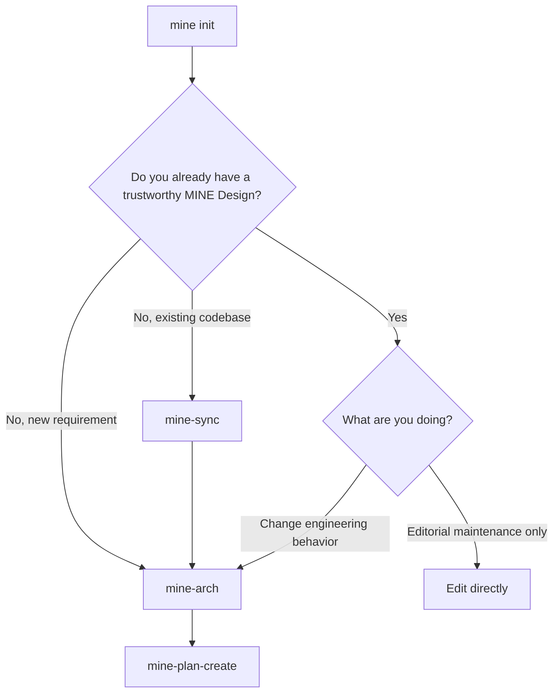
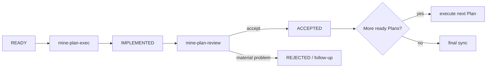

# MINE User Guide

This guide follows the order in which you actually use MINE. If you only want the mental model, read [Concepts](concepts.md).

## 1. Install MINE

### Windows

```powershell
irm https://raw.githubusercontent.com/6ixGODD/mine-is-not-everyones/master/scripts/bootstrap.ps1 | iex
```

### macOS / Linux

```sh
curl -fsSL https://raw.githubusercontent.com/6ixGODD/mine-is-not-everyones/master/scripts/bootstrap.sh | sh
```

Reopen the terminal, then check the binary and Agent integrations:

```sh
mine --version
mine agent status
```

`mine setup` manages machine-level integration with Claude Code, Codex, Pi, and OpenCode. Run it again when you want to add or repair an Agent integration.

## 2. Initialize a repository

From the Git repository root:

```sh
mine init
```

This establishes MINE's repository state: `.mine/config.toml`, the managed `docs/design/` namespace, and repository governance. It does not design the system or implement features.

If an unrelated `docs/design/` already exists, `mine init` preserves it in a timestamped local backup and creates MINE's managed Design root.

## 3. Choose your starting point



### Existing codebase: establish a baseline

Use `mine-sync` when the code already exists but the Design does not yet describe it accurately:

```text
mine-sync synchronize the authentication subsystem
```

Scope large repositories. An unscoped sync may inspect broadly because it has to reconstruct the current system from repository evidence.

After the baseline is trustworthy, describe the change you want:

```text
mine-arch Add Passkey login and preserve the existing session model.
```

### New work: define the target

For a new repository or a new architectural change:

```text
mine-arch Build a local task-management CLI with import, export, and undo.
```

`mine-arch` updates the target Design. It does not implement the change.

### Small editorial maintenance

A typo, translation, prose cleanup, broken link, or other unambiguous behavior-preserving edit does not need a Plan. Change it directly, validate what is relevant, and commit it normally.

If the edit changes or establishes behavior, architecture, CLI semantics, Skill behavior, release rules, security boundaries, or another durable engineering contract, it is not editorial maintenance; use the normal MINE flow.

## 4. Turn Design into executable work

When the Design is ready:

```text
mine-plan-create
```

This creates the temporary development workspace and one or more Plans. A Plan is an implementation contract, not a progress note.

You normally do not edit the execution graph or choose graph revisions yourself. MINE manages those mechanics.

## 5. Execute and review Plans

For each ready Plan:

```text
mine-plan-exec <Plan path>
```

The implementation Agent changes the scoped files, runs the relevant checks, commits its work, and finishes at `IMPLEMENTED`. It cannot accept its own work.

Use another review session:

```text
mine-plan-review <Plan path>
```

The Reviewer independently inspects the implementation and its evidence. It may make narrow corrections when the accepted Design already determines the right answer; otherwise it rejects the Plan and the workflow creates follow-up work.



Repeat until the execution graph is terminal and the intended work is accepted.

## 6. Close a release

Release closure has two explicit steps because they answer different questions.

### Phase A: does Design describe what was actually built?

After the last Plan is accepted and integrated:

```text
mine-sync prepare this repository for stable release
```

This reconciles the final implementation back into durable Design and records fresh synchronization evidence.

### Phase B: can this exact product state become stable?

Then run:

```text
mine-plan-review complete release closure
```

The Reviewer verifies freshness and release gates, constructs and validates the stable candidate, removes temporary Plan state from the stable tree, performs the local curated integration, and cleans up MINE-managed local development branches.

It does not push or publish remotely. Those actions remain explicit user decisions.

## 7. Understand the repository while MINE is active

During a development cycle:

```text
stable (main/master)
    │
    └── dev
         ├── docs/plan/
         ├── plan/01-...
         ├── plan/02-...
         └── accepted work accumulates here
```

At release closure, stable receives the accepted product state through curated integration. Temporary Plan history and `docs/plan/` do not become part of stable history.

`docs/design/` is different: it is durable and remains with the product.

## 8. Diagnostics and maintenance commands

Use machine-level commands when the problem is installation or Agent integration:

```sh
mine agent status
mine setup
mine update
mine uninstall
```

Use repository diagnostics inside an initialized repository:

```sh
mine status
mine doctor
mine design status
mine design validate
mine graph status
mine graph ready
mine plan show --id <id>
mine release --format json
```

`mine agent status` and `mine doctor` intentionally answer different questions: the first is about machine-level Agent installation; the second evaluates the current repository as well.

When a command fails, start with its concrete human or JSON output rather than looking for a generic troubleshooting recipe. The CLI is the authoritative diagnostic surface.

## 9. What you usually do not need to touch

Normal users should rarely need to operate the low-level Plan transition commands, manually edit graph files, manage report paths, construct stable candidates, or hand-integrate `plan/*` branches. Those interfaces exist so Skills can make deterministic transitions.

The everyday workflow is:

```text
init → arch/sync → plan → execute → review → final sync → release closure
```

For the reasoning behind that workflow, continue with [MINE Concepts](concepts.md).