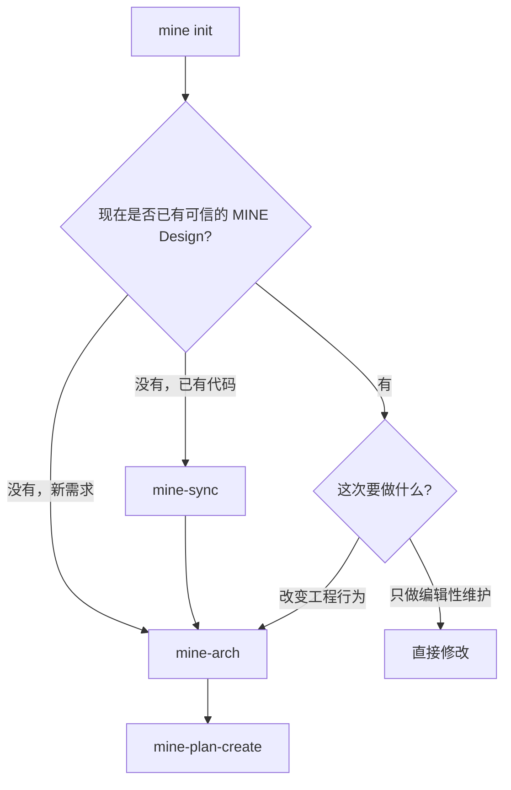
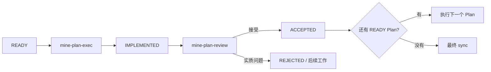

# MINE 用户指南

这份指南按照你实际使用 MINE 的顺序来写。如果你只想先理解它为什么这样设计，可以直接看[核心概念](concepts.zh-CN.md)。

## 1. 安装 MINE

### Windows

```powershell
irm https://raw.githubusercontent.com/6ixGODD/mine-is-not-everyones/master/scripts/bootstrap.ps1 | iex
```

### macOS / Linux

```sh
curl -fsSL https://raw.githubusercontent.com/6ixGODD/mine-is-not-everyones/master/scripts/bootstrap.sh | sh
```

安装完成后重新打开终端，然后确认二进制和 Agent 集成状态：

```sh
mine --version
mine agent status
```

`mine setup` 管理机器级的 Claude Code、Codex、Pi 和 OpenCode 集成。以后要新增或修复某个 Agent 集成时，可以重新运行它。

## 2. 初始化仓库

在 Git 仓库根目录运行：

```sh
mine init
```

这一步建立 MINE 的仓库状态：`.mine/config.toml`、受管理的 `docs/design/` 命名空间，以及仓库治理规则。它不会替你设计系统，也不会实现功能。

如果仓库原本已经有一个与 MINE 无关的 `docs/design/`，`mine init` 会先把它保存到带时间戳的本地备份，再创建 MINE 自己的 Design 根目录。

## 3. 选择起点



### 已有代码库：先建立基线

代码已经存在，但 Design 还不能准确描述它时，用 `mine-sync`：

```text
mine-sync 同步认证与授权子系统
```

大型仓库建议明确范围。无范围的 sync 可能会广泛探索仓库，因为它需要从代码、测试、配置和其他证据中重建当前系统。

基线可信后，再描述你真正要做的变更：

```text
mine-arch 增加 Passkey 登录，并保留现有 session 模型。
```

### 新工作：定义目标

新仓库，或者已有仓库里准备做新的架构变更时：

```text
mine-arch 构建一个支持导入、导出和撤销的本地任务管理 CLI。
```

`mine-arch` 修改的是目标 Design，不负责实现。

### 小型编辑性维护

错别字、翻译、文字整理、坏链接，或其他结果明确且不改变行为的修改，不需要为了形式再创建 Plan。直接修改、做相关校验、正常提交即可。

如果文档修改本身改变或建立了行为、架构、CLI 语义、Skill 行为、发布规则、安全边界或其他持久工程契约，那它就不再是编辑性维护，应回到正常 MINE 流程。

## 4. 把 Design 变成可执行工作

Design 已经明确后：

```text
mine-plan-create
```

它会创建临时开发工作区，并生成一个或多个 Plan。Plan 是实现契约，不是进度笔记。

正常情况下，你不需要手动编辑 execution graph，也不需要自己处理 revision。那些机械状态由 MINE 管理。

## 5. 执行和审查 Plan

对每个已经 READY 的 Plan：

```text
mine-plan-exec <Plan 路径>
```

Implementation Agent 修改 Plan 范围内的文件、执行相关检查、提交代码，并停在 `IMPLEMENTED`。它不能接受自己的工作。

换一个独立审查会话：

```text
mine-plan-review <Plan 路径>
```

Reviewer 独立检查实现和证据。如果 accepted Design 已经能唯一确定正确答案，Reviewer 可以做局部修正；如果问题意味着核心方案、范围或 Design 需要变化，则拒绝当前 Plan，并产生后续工作。



重复这个过程，直到 execution graph 进入终态，计划中的工作全部完成并被接受。

## 6. 发布收口

发布分成两个明确阶段，因为它们回答的是两个不同问题。

### Phase A：Design 是否已经描述了最终真正构建出来的东西？

最后一个 Plan 被接受并集成后：

```text
mine-sync prepare this repository for stable release
```

这一步把最终实现重新调和进持久 Design，并记录 fresh synchronization evidence。

### Phase B：这个精确的产品状态是否可以进入 stable？

然后运行：

```text
mine-plan-review complete release closure
```

Reviewer 会验证 freshness 和 release gates，构造并验证 stable candidate，从 stable tree 中移除临时 Plan 状态，完成本地 curated integration，并清理 MINE 管理的本地开发分支。

它不会替你 push 或做远程发布。远程 mutation 仍然是用户显式决定。

## 7. MINE 工作期间，仓库里发生了什么

开发周期中：

```text
stable (main/master)
    │
    └── dev
         ├── docs/plan/
         ├── plan/01-...
         ├── plan/02-...
         └── 已接受的工作逐步汇总到这里
```

发布收口时，stable 通过 curated integration 得到最终接受的产品状态。临时 Plan 历史和 `docs/plan/` 不进入 stable history。

`docs/design/` 不一样：它是持久工程知识，会跟着产品留在 stable。

## 8. 诊断与维护命令

如果问题发生在机器安装或 Agent 集成，用机器级命令：

```sh
mine agent status
mine setup
mine update
mine uninstall
```

如果问题发生在某个已经初始化的仓库里，用仓库级诊断：

```sh
mine status
mine doctor
mine design status
mine design validate
mine graph status
mine graph ready
mine plan show --id <id>
mine release --format json
```

`mine agent status` 和 `mine doctor` 本来就回答不同问题：前者只看机器级 Agent 集成，后者还会检查当前仓库。

命令失败时，优先看它实际给出的 human/JSON 诊断，而不是先去寻找一个泛泛的“故障排查套路”。CLI 自己才是最具体的诊断入口。

## 9. 平时不需要自己碰的东西

普通用户很少需要手工操作底层 Plan transition 命令、直接编辑 graph 文件、管理 report 路径、自己构造 stable candidate，或者手动把 `plan/*` 集成进 `dev`。这些接口主要是为了让 Skill 做确定性状态转换。

日常工作流可以记成：

```text
init → arch/sync → plan → execute → review → final sync → release closure
```

想进一步理解为什么 MINE 要把 Design、Plan、Review 和 Stable 分开，继续看[核心概念](concepts.zh-CN.md)。